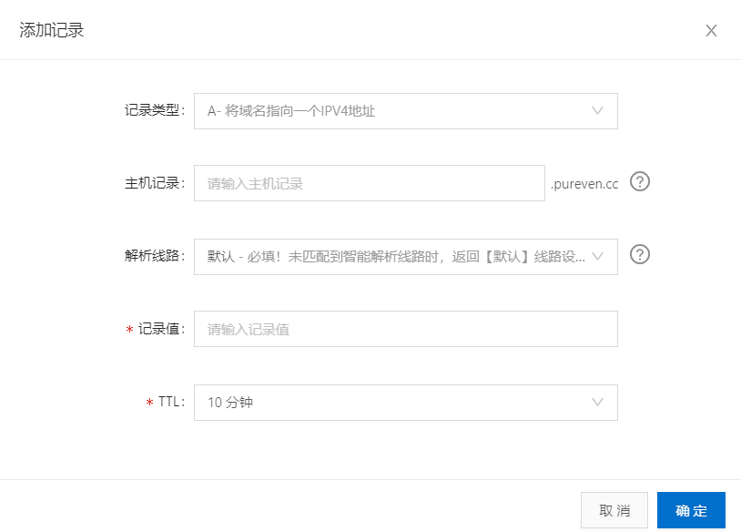
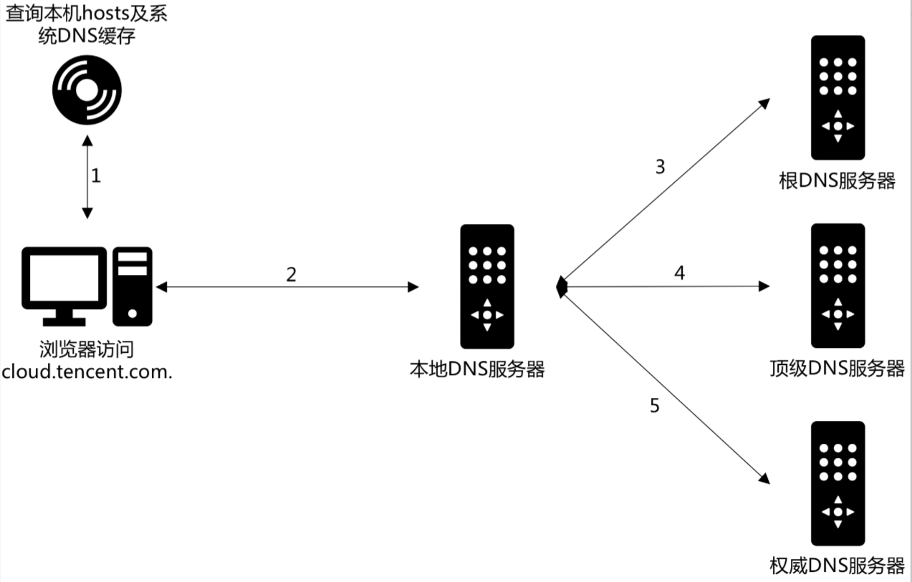

#### 引言 ####

在阿里云上注册了一个域名`pureven.cc`，选择`.cc`是因为感觉有个性吧。但是注册完成后紧跟着有几个问题：①如何将域名跟我的网站联系起来呢？②我的博客是放到github上面的，并给仓库取名`pureven.github.io`，如何将注册的域名跟我的博客仓库连接起来，实现当我访问`pureven.cc`的时候直接访问我的博客？

<!-- more -->

#### 什么是域名解析 ####

为了解决上述问题，这里引入域名解析的概念。`域名解析`**就是把域名指向网站所在服务器的IP，让人们通过注册的域名可以访问到网站**。IP地址是网络上标识服务器的数字地址，为了方便记忆，使用域名来代替IP地址。域名解析就是域名到IP地址的转换过程，域名的解析工作由DNS服务器完成。DNS服务器会把域名解析到一个IP地址，然后在此IP地址的主机上将一个子目录与域名绑定。域名解析时会添加解析记录，这些记录有：A记录、AAAA记录、CNAME记录、MX记录、NS记录、TXT记录、SRV记录、URL转发。

---

#### 添加记录各选项说明 ####

以阿里云域名解析记录类型为例，一条记录由`记录类型`、`主机记录`、`解析线路`、`记录值`和`TTL`组成，如图：


##### 记录类型 #####

记录类型有以下几种：

| 记录类型 | 介绍 |
| ---: | --: |
| A | 地址记录，用来指定域名的 IPv4 地址（例如 8.8.8.8），如果需要将域名指向一个 IP 地址（外网地址） |
| CNAME | 将域名指向另一个域名，即用来定义域名的别名，方便实现将多个域名解析到同一个 IP 地址 |
| AAAA | 用来指定主机名（或域名）对应的 IPv6 地址（例如 ff06:0:0:0:0:0:0:c3）记录`注意：截止到11月25号，IPV4已经用完` |
| NS | 用来指定域名由哪个DNS服务器进行解析，比如把域名`blog.pureven.cc`交给`12.34.56.78`这台服务器进行解析，则需要设置`blog.pureven.cc`的NS记录，需要注意的是`NS的优先级比A/CNAME的高` |
| MX | 用来指定收件人域名的邮件服务器，SMTP 协议会根据 MX 记录的值来决定邮件的路由过程，例如用户所用的邮件是以域名`pureven.com`为结尾的，则需要在管理界面中添加该域名的MX记录来处理所有以`@pureven.com`结尾的邮件 |
| SRV | 记录提供特定的服务的服务器 |
| SOA | 称为起始授权机构记录，不同于 NS 记录用于标识多台域名解析服务器，SOA 记录用于在多台 NS 记录中哪一台是主 DNS 服务器 |
| PTR | 常用于反向地址解析，将 IP 地址解析到对应的名称 |
| TXT | 文本长度限制512，通常做SPF记录(反垃圾邮件) |
| CAA | CA证书颁发机构授权校验 |
| 显性URL | 将域名重定向到另外一个地址，比如将`www.pureven.cc`显性转发到`www.pureven.com`后，当访问`www.pureven.cc`时，地址栏显示的地址是`www.pureven.com` |
| 隐性URL | 与显性URL类似，但是会隐藏真实目标地址，比如将`www.pureven.cc`隐性转发到`www.pureven.com`后，当访问`www.pureven.cc`时，地址栏显示的是`www.pureven.cc`，实际访问的是`www.pureven.com` |


**说明：** A记录就是把一个域名解析到一个IP地址（Address，特制数字IP地址），而CNAME记录就是把域名解析到另外一个域名。其功能是差不多，CNAME将几个主机名指向一个别名，其实跟指向IP地址是一样的，因为这个别名也要做一个A记录的。但是使用CNAME记录可以很方便地变更IP地址。如果一台服务器有100个网站，他们都做了别名，该台服务器变更IP时，只需要变更别名的A记录就可以了。
 
---

##### 主机记录 #####

主机记录就是域名前缀，常见用法有：

| 主机记录 | 用法 |
| :--: | :--: |
| www | 解析后的域名为`www.pureven.com` |
| @ | 直接解析主域名 `pureven.com` |
| * | 泛解析，匹配其他所有域名 `*.pureven.com` |
| mail | 将域名解析为`mail.pureven.com`，通常用于解析邮箱服务器 |
| 二级域名 | 如：`abc.pureven.com`，填写abc |
| 手机网站 | 如：`m.pureven.com`，填写m |
| 显性URL | 不支持泛解析（泛解析：将所有子域名解析到同一地址）|

---

##### 解析线路 #####

不同套餐支持的解析线路，本域名使用的免费的版，因此支持**默认、境外、移动、电信、联通、教育网、百度、必应、谷歌**

下面时[腾讯](https://cloud.tencent.com/document/product/302/8643)的说明：
>例如，将 cloud.tencent.com 设置【默认】线路解析到8.8.8.8，【广东】线路解析到9.9.9.9，【广东电信】线路解析到10.10.10.10，则广东的电信运营商用户访问将返回10.10.10.10的 IP 地址，广东非电信运营商用户访问将返回9.9.9.9的 IP 地址，非广东地区用户访问将返回8.8.8.8的 IP 地址。
此时若暂停广东电信线路或广东线路的解析，全国地区的解析都不会受到影响，将全部返回8.8.8.8的 IP 地址。所以无论是否添加地区或者运营商的线路，一定需要先添加好【默认】线路的解析。
>
>搜索引擎线路使用说明
搜索引擎线路可以设置百度、谷歌等的蜘蛛抓取不同的 IP 地址。例如，将 cloud.tencent.com 设置【默认】线路解析到8.8.8.8；【百度】线路解析到9.9.9.9；【搜狗】线路解析到10.10.10.10，则用户通过搜狗搜索到站点进行访问，将返回10.10.10.10的 IP 地址；通过百度搜索访问，将返回9.9.9.9的 IP 地址；直接访问站点，将返回8.8.8.8的 IP 地址。


| 解析线路 | 说明 |
| -- | -- |
| 默认 | 若您未设置特定解析线路，则所有线路用户均访问该目标地址 |
| 联通 | 单独为用【联通线路】访问的用户指定目标地址，其他用户仍然访问默认的目标地址 |
| 电信 | 单独为用【电信线路】访问的用户指定目标地址，其他用户仍然访问默认的目标地址 |
| 移动 | 单独为用【移动线路】访问的用户指定目标地址，其他用户仍然访问默认的目标地址 |
| 境外 | 单独为用【境外线路】访问的用户指定目标地址，其他用户仍然访问默认的目标地址 |
| 教育网 | 单独为用【教育网线路】访问的用户指定目标地址，其他用户仍然访问默认的目标地址 |
| 搜索引擎 | 指定一个服务器IP让搜索引擎（谷歌、百度、必应等）蜘蛛抓取 |

---

##### 记录值 #####

**记录值**的设置跟记录类型有关，下面通过表格进行举例：

| 记录类型 | 记录值 |
| :--: | :--: |
| A | 8.8.8.8 |
| CNAME | `pureven.github.io` |
| AAAA | ff06:0:0:0:0:0:0:c3 |
| NS | `ns.pureven.cc` |
| MX | `mail.pureven.cc` |
| SRV | 1 0 9 `srv.pureven.cc` |
| TXT | 2018113000666039ccllnqjav9an2l2zu717m10ovdfp5n972hcj9gzeseklbmt1 |
| CAA | 假如只允许由 `symantec.com` 来颁发域名 `pureven.cc` 的证书，并且发送违规通知到邮箱 `admin@pureven.cc`，则需要设置为 `0 issue "symantec.com"` 和 `0 iodef "mailto:admin@pureven.cc"`|
| 显性URL | `www.pureven.com` |
| 隐性URL | `www.pureven.com` |

---

##### TTL #####

TTL是英语Time-To-Live的简称，意思为一条域名解析记录在DNS服务器中的存留时间。当各地的DNS服务器接受到解析请求时，就会向域名指定的NS服务器发出解析请求从而获得解析记录；在获得这个记录之后，记录会在DNS服务器中保存一段时间，这段时间内如果再接到这个域名的解析请求，DNS服务器将不再向NS服务器发出请求，而是直接返回刚才获得的记录；而这个记录在DNS服务器上保留的时间，就是TTL值。以阿里云为例，可以设置TTL的值为`10分钟`、`30分钟`、`1小时`、`12小时`、`1天`。

选择时根据需求有两种策略：
- 增大TTL值，减少域名解析时间。
一般情况下，域名解析的各个记录可能很长一段时间内都不会有变化。我们可以增大域名记录的TTL值让记录在各地DNS服务器中缓存的时间加长，这样在更长的一段时间内，我们访问这个网站时，本地ISP的DNS服务器就不需要向域名的DNS服务器发出解析请求，而直接从缓存中返回域名解析记录。不过需要注意的是，如果TTL设置的值过大，当您的网站更换空间时，旧的记录要很久才会更新，有时会造成网站的重要变动不能及时更新。

- 减小TTL值，及时更新网络。
更换空间99.9%会有DNS记录更改的问题，因为缓存的问题，新的域名记录在有的地方可能生效了，但在有的地方可能等上一两天甚至更久才生效。结果就是有的人可能访问到了新服务器，有的人访问到了旧服务器。这时我们可以减TTL值，让DNS服务器中的缓存尽快刷新。减少TTL值的操作必须在主机调整/网络调整之前提前进行。这样才能保证在主机/网络调整完成后，能够在最小时间内实现更新。不过如果数值设置太小，会使DNS频繁刷新，有时会造成访问不稳定。

---

#### 添加记录举例 ####

下面是本站解析记录，仅供参考：
<table>
<tr>
<th style="text-align:center">name</th>
<th>value</th>
</tr>
<tr>
<td>记录类型</td>
<td>CNAME</td>
</tr>
<tr>
<td>主机记录</td>
<td>@</td>
</tr>
<tr>
<td>解析线路</td>
<td>默认</td>
</tr>
<tr>
<td>记录值</td>
<td>pureven.github.io</td>
</tr>
<tr>
<td>TTL</td>
<td>10分钟</td>
</tr>
</table>

---

域名仅仅是为了方便人类的记忆而设计的名称，计算机在网络中进行通讯时不能识别域名，只能识别IP地址，所以计算机在进行网络通讯之前需要先完成域名到IP的转化，我们称之为域名解析。添加完域名解析记录，当访问域名时是什么机制让浏览器显示博客内容的呢，下面是对DNS解析过程的记录

#### 域名解析过程: 腾讯示例 ####

早期接入互联网的设备很少，IP的管理比较简单，最开始是是通过`本地Hosts文件`的方式对域名和IP的映射关系进行管理；后来为了解决本地Host带来的配置不一致的问题，改为`Hosts文件由Ftp统一发布`，各个设备定时从Ftp更新Hosts 文件；再到后来出现了`中心化的DNS服务集群提供域名解析服务`；但随着接入互联网的设备增加，域名解析的请求量暴增，中心化的DNS服务集群开始暴露出明显的缺陷。客户机直接将所有查询请求发往中心化的DNS服务器，同时DNS服务器直接对所有查询客户机做出响应，出现了有单点故障，通信容量，远距离通信延迟，维护开销大等问题。为了解决中心化DNS服务存在的问题，出现了`分布式DNS层次架构`。

目前DNS服务器分为三种，即`根DNS服务器`、`顶级DNS服务器`、`权威DNS服务器`。当然还可以假设自己`本地的DNS服务器`，如图：

1. 当在浏览器中输入URL时，浏览器会先检查`自己的缓存`是否有域名IP的映射关系，有则直接使用IP进行通信；
2. 如果浏览器没有缓存，则操作系统会检查`本地Hosts文件`是否有域名IP的映射关系，有则使用IP进行通信；
3. 如果hosts里没有这个域名的映射，则查找`本地DNS解析器缓存`，是否有映射关系，有则直接返回完成域名解析；
4. 如果至此还未找到映射关系，首先会找TCP/IP参数中设置的`首选DNS服务器`，也就是常称的`本地DNS服务器`，如果服务器已缓存了映射关系，则使用这个IP地址映射返回完成域名解析，`此时解析不具有权威性`；
5. 如果本地DNS服务器缓存已经失效(以转发模式为例)，本地DNS服务器就把请求发至13组`根DNS服务器`，根DNS服务器收到请求后会判断这个.com域名是谁管理，并会返回一个负责该`顶级域名服务器`。本地DNS服务器收到顶级域名服务器信息后，将会联系负责.com域的服务器。该.com域的服务器收到请求后，如果自己无法解析，它就会找一个管理.com域的下一级.tencent.com域DNS服务器给本地DNS服务器。`当本地DNS服务器收到该服务器的信息后，就会找向.tencent.com域服务器查询cloud.tencent.com域名指向的主机地址，返回给浏览器并将映射关系缓存，至此完成域名解析的过程。`
整个迭代查询的过程均通过`本地DNS服务器`进行，最后都是把结果返回给本地DNS服务器，由此DNS服务器再返回给客户机。

#### dig命令跟踪解析过程 ####

执行命令`yum install bind-utils`安装`dig`，也可通过`docker pull pureven/yum.centos7`下载yum镜像然后在容器中运行`dig`命令。

##### dig pureven.cc 获取 pureven.cc的A地址 #####

执行`dig pureven.cc`获取`pureven.cc`的IP地址：
```text
[root@884df7c06f10 /]# dig pureven.cc

; <<>> DiG 9.11.4-P2-RedHat-9.11.4-9.P2.el7 <<>> pureven.cc
;; global options: +cmd
;; Got answer:
;; ->>HEADER<<- opcode: QUERY, status: NOERROR, id: 46662
;; flags: qr rd ra; QUERY: 1, ANSWER: 5, AUTHORITY: 0, ADDITIONAL: 1

;; OPT PSEUDOSECTION:
; EDNS: version: 0, flags:; udp: 512
;; QUESTION SECTION:
;pureven.cc.			IN	A

;; ANSWER SECTION:
pureven.cc.		599	IN	CNAME	pureven.github.io.
pureven.github.io.	3599	IN	A	185.199.110.153
pureven.github.io.	3599	IN	A	185.199.108.153
pureven.github.io.	3599	IN	A	185.199.111.153
pureven.github.io.	3599	IN	A	185.199.109.153

;; Query time: 101 msec
;; SERVER: 8.8.8.8#53(8.8.8.8)
;; WHEN: Wed Dec 04 07:16:57 UTC 2019
;; MSG SIZE  rcvd: 134
```
- `status` 表示查询状态，取值为 `NOERROR` 表示查询没什么错误；
- `opcode` 表示操作码，取值为 `QUERY` 表示操作为查询操作；
- `id` 表示查询事务id 46662；
- `QUERY` 表示查询内容的条数，`ANSEWER` 表示回答内容条数，`AUTHORITY` 表示权威应答内容的条数，`ADDITIONAL` 表示附加内容的条数；
- `QUESTION SECTION`：表示需要查询的内容，这里的返回内容表示需要查询域名的 A 记录；
- `ANSWER SECTION` 表示查询结果，包含了五条记录，一条记录表示`pureven.cc`是 `pureven.github.io`的别名，第二至五条返回了 A 记录，表明 `pureven.github.io` 的 IP 地址，其中599和3599分别表示本次查询的缓存时间，分别在这些`秒数`内容本地 DNS 服务器可以直接从缓存返回结果。

##### dig +trace pureven.cc 查看解析流程 #####

执行命令`dig +trace pureven.cc`跟踪从根名称服务器开始的迭代查询过程：
```text
[root@884df7c06f10 /]# dig +trace pureven.cc

; <<>> DiG 9.11.4-P2-RedHat-9.11.4-9.P2.el7 <<>> +trace pureven.cc
;; global options: +cmd
.			78407	IN	NS	a.root-servers.net.
.			78407	IN	NS	b.root-servers.net.
.			78407	IN	NS	c.root-servers.net.
.			78407	IN	NS	d.root-servers.net.
.			78407	IN	NS	e.root-servers.net.
.			78407	IN	NS	f.root-servers.net.
.			78407	IN	NS	g.root-servers.net.
.			78407	IN	NS	h.root-servers.net.
.			78407	IN	NS	i.root-servers.net.
.			78407	IN	NS	j.root-servers.net.
.			78407	IN	NS	k.root-servers.net.
.			78407	IN	NS	l.root-servers.net.
.			78407	IN	NS	m.root-servers.net.
.			78407	IN	RRSIG	NS 8 0 518400 20191217020000 20191204010000 22545 . Sv7vE9am31rq4zst2ZI/aF44WyBzwZQXqZUhsGJoOxUoI8a5Qo/78uMK xc1tuK0RcSuvq2Au01QkmXD97blwQ0MKntMy3cshIuxy1k6rmV1QqL97 yB/8rFBlLr/S65/E/lFmyL9omqiuzo/aJq/fuUFI3QKZhvyI7ix4KhIe 1QGM1X840XAR33akPM0zKlRGwvAL7hpml3UDCl9190k0gDZVzpj9hXfX rEOFnuK+pJNZr6OHRtVd+0n6EU+OFMMvNhOysPJihnRDGpj/FsjFNYJD 4Bof3YqyC41QDVGufd22UjwigODNzAu6N2FZ4g2xrZUk9E4HVL5tsgTQ aAZ5JQ==
;; Received 525 bytes from 8.8.8.8#53(8.8.8.8) in 47 ms

cc.			172800	IN	NS	ac1.nstld.com.
cc.			172800	IN	NS	ac2.nstld.com.
cc.			172800	IN	NS	ac3.nstld.com.
cc.			172800	IN	NS	ac4.nstld.com.
cc.			86400	IN	DS	519 8 1 7285EF05E1B4E679D4F072EEA9B00953E01F3AE2
cc.			86400	IN	DS	519 8 2 E1EC6495ABD34562E6F433DEE201E6C6A52CB10AF69C04D675DA692D 2D566897
cc.			86400	IN	RRSIG	DS 8 1 86400 20191217050000 20191204040000 22545 . Q5gyHPvB2jy6ZeXfbhP5/RQ6fYKLtiM8skXeyZfvKJyvcvkJQHCtzdXc eoLtBIC7QTusjTmpHJemMt4HDnKOx/HcucVHZ8ErYZFWE/LEr/T7+TXE 3q57JS1zyUiAzbccoel4vXdNR4CPkvqFjy5fabKPpGH+h+yoFFe3IAUe +IcBB0kSBp2lDG6MWdLq7NpGy4RCjOCByoEsx1sHfDfflTk+QmkhgBHZ 6hB82AUvYQwSY34MjEXt8nI/LlC8FvuuIfh1nzztYVF1nSC5xWOrGWlO 1/S+QadLGDphnOa5va0UQwcSiCZ/cEarT+sFQsLtjjWrOOi7oeIHeDB/ VISe3w==
;; Received 667 bytes from 198.41.0.4#53(a.root-servers.net) in 245 ms

pureven.cc.		172800	IN	NS	dns25.hichina.com.
pureven.cc.		172800	IN	NS	dns26.hichina.com.
RQGAP5UF6Q1NGVCKFNO8RANVDN5ILRIN.cc. 86400 IN NSEC3 1 1 0 - RR9VRBALT8EOD9SAK335LVITNSQII5FL NS SOA RRSIG DNSKEY NSEC3PARAM
RQGAP5UF6Q1NGVCKFNO8RANVDN5ILRIN.cc. 86400 IN RRSIG NSEC3 8 2 86400 20191209152154 20191202152154 31648 cc. VqHIOwVsxuJ6fwH54KenuthJ25iPZR+2g8HNYEKkXLzj/YsefVjugjhv 1AitS5r0Y+LSR4Ope8i2D/D+lquu3/S/A2WzqXyreQodwPT/G0YpAVVC twFuAET4lNIxAeaM1+FOBDCc6JhzwhlHFy/cLqW/pNEQD3R9nrWIV5rS BYHPPit8dQR57i5v3yaRUF7iZpLoaI4qNSVWm74aStNiYQ==
647QGA0JFP99RQ6J0THT7LDCEH8L2S09.cc. 86400 IN NSEC3 1 1 0 - 64BGMELNKRMPIIFKC92FM52GH6A42IQQ NS DS RRSIG
647QGA0JFP99RQ6J0THT7LDCEH8L2S09.cc. 86400 IN RRSIG NSEC3 8 2 86400 20191210092032 20191203092032 31648 cc. GxawAkx6GuhivmZBFinOV2wlXYJqpNuEfIRk9DhY7SKPsGYiFbY8lhw2 arVhYsCFqMPJ75nW8WiHMa7e3R/YUrvN3w9DPd6t4xMsLbSNE2bIPj9z b6CqETnreoLD8QXC1dle6KvhL0LHvOou4UsfaWTarrzCu5BD81haLdeP jcVvMgO8IYtiwUnqVwDzr9dixYCPGlX7fgMbm/3/gcMPhA==
;; Received 637 bytes from 192.42.173.30#53(ac1.nstld.com) in 60 ms

pureven.cc.		600	IN	CNAME	pureven.github.io.
;; Received 70 bytes from 106.11.211.69#53(dns25.hichina.com) in 24 ms
```
- 第一部分本地DNS(8.8.8.8)内部记录了13台全球[根域名服务器的地址](ftp://ftp.internic.net/domain/named.root)，继续向这13台全球根域名服务器请求.cc顶级域名服务器地址，以最先回复的为准。

- 最先回复的根域名服务器是`a.root-servers.net`(198.41.0.4)，返回7台.cc顶级域名服务器的域名和地址，继续向这些.cc顶级域名服务器请求查询pureven.cc二级域名服务器地址。

- 最先回复的.cc顶级域名服务器是`ac1.nstld.com`(192.42.173.30)(Network Solutions top level domain的缩写)，返回2台pureven.cc二级域名服务器的域名及域名解析服务器域名，继续向这2个域名解析服务器获取pureven.cc地址。

- 最先回复的pureven.cc二级域名服务器是`dns25.hichina.com`(106.11.211.69)，返回的结果是`pureven.github.io`，其中**CNAME记录代表的是`pureven.cc`的别名，也就是说要想获取pureven.cc的IP，需要继续跟踪`pureven.github.io`**。

##### dig +trace pureven.github.io 获取pureven.cc的A地址 #####

继续执行命令`dig +trace pureven.github.io`跟踪从根名称服务器开始的迭代查询过程:
```text

[root@884df7c06f10 /]# dig +trace pureven.github.io
; <<>> DiG 9.11.4-P2-RedHat-9.11.4-9.P2.el7 <<>> +trace pureven.github.io
;; global options: +cmd
.			75118	IN	NS	a.root-servers.net.
.			75118	IN	NS	b.root-servers.net.
.			75118	IN	NS	c.root-servers.net.
.			75118	IN	NS	d.root-servers.net.
.			75118	IN	NS	e.root-servers.net.
.			75118	IN	NS	f.root-servers.net.
.			75118	IN	NS	g.root-servers.net.
.			75118	IN	NS	h.root-servers.net.
.			75118	IN	NS	i.root-servers.net.
.			75118	IN	NS	j.root-servers.net.
.			75118	IN	NS	k.root-servers.net.
.			75118	IN	NS	l.root-servers.net.
.			75118	IN	NS	m.root-servers.net.
.			75118	IN	RRSIG	NS 8 0 518400 20191217020000 20191204010000 22545 . Sv7vE9am31rq4zst2ZI/aF44WyBzwZQXqZUhsGJoOxUoI8a5Qo/78uMK xc1tuK0RcSuvq2Au01QkmXD97blwQ0MKntMy3cshIuxy1k6rmV1QqL97 yB/8rFBlLr/S65/E/lFmyL9omqiuzo/aJq/fuUFI3QKZhvyI7ix4KhIe 1QGM1X840XAR33akPM0zKlRGwvAL7hpml3UDCl9190k0gDZVzpj9hXfX rEOFnuK+pJNZr6OHRtVd+0n6EU+OFMMvNhOysPJihnRDGpj/FsjFNYJD 4Bof3YqyC41QDVGufd22UjwigODNzAu6N2FZ4g2xrZUk9E4HVL5tsgTQ aAZ5JQ==
;; Received 525 bytes from 8.8.8.8#53(8.8.8.8) in 43 ms

io.			172800	IN	NS	b0.nic.io.
io.			172800	IN	NS	c0.nic.io.
io.			172800	IN	NS	a0.nic.io.
io.			172800	IN	NS	a2.nic.io.
io.			86400	IN	DS	57355 8 1 434E91E206134F5B3B0AC603B26F5E029346ABC9
io.			86400	IN	DS	57355 8 2 95A57C3BAB7849DBCDDF7C72ADA71A88146B141110318CA5BE672057 E865C3E2
io.			86400	IN	RRSIG	DS 8 1 86400 20191217050000 20191204040000 22545 . cN4eQjUQPI8Osm0qq6YH+nK5RuGI8CUIE9uqX8KH/a3Je/kcUWPgzIAo snHNKsZ26rBwEXs9xhn+QoLsP6QIZBaLlv1Jg/WfPtqMf60gUBHlZdHw TUMrhRTtCAxileEy7DxYo8rUQI5aqApcTmemRYLBU8mKjPA2Qf4IS/hG +2ZpchpO1tvwVK4IaUBInGs2u/lYQ90sTpOF9TS94fhQM/8tqDk92ho3 Mi+QisCyH0iH6vjXY45ruvycfPmfLo3WNs0vk5TGm0OEC5RqHwJDPxdb Y6DCX6qx1QD3oxQLiH5k2V1K4vForADpLkW+dqVifSNyW9JmqnSRx6bO 3otu5A==
;; Received 665 bytes from 202.12.27.33#53(m.root-servers.net) in 55 ms

github.io.		86400	IN	NS	ns-1339.awsdns-39.org.
github.io.		86400	IN	NS	ns-1622.awsdns-10.co.uk.
github.io.		86400	IN	NS	ns1.p16.dynect.net.
github.io.		86400	IN	NS	ns-692.awsdns-22.net.
github.io.		86400	IN	NS	ns2.p16.dynect.net.
2iui5t1khct6c5o8i2i67rppatgvegqo.io. 900 IN NSEC3 1 1 1 D399EAAB 2IV073DVU92DLMV2H5L9G1PEODM9RDE6 NS SOA RRSIG DNSKEY NSEC3PARAM
2iui5t1khct6c5o8i2i67rppatgvegqo.io. 900 IN RRSIG NSEC3 8 2 900 20191225075606 20191204065606 53658 io. IEHBBraKpWnNEFSKmJLlhPBc3XVfCDIsju/vFg9GlaIlQ0XBfdxAoMNy KPPEEvWY/Qmj4ZLeNQGG1i9hcrDooN+W/ENW0n4WQF2XQWh0vNmJX5Ja eT/EnnXBxGeBtw6Olg5mlWk1zmtMz0ui75Mm50wdo6dM16otHLdyKwWS QdQ=
ldl8iscjau4ngcq5m160b1gbj7je9bj1.io. 900 IN NSEC3 1 1 1 D399EAAB LDN62SC6T38Q0FPNL9L6VNHBR53J840J NS DS RRSIG
ldl8iscjau4ngcq5m160b1gbj7je9bj1.io. 900 IN RRSIG NSEC3 8 2 900 20191222151600 20191201141600 53658 io. T8pm01fOV0JPPkZw/Q7OvR+y9gluPSBLM5j5uOXgkBLe7iSxnM9FOtCL eBBjO53LkLziMcYYXCUkLWT6MiONA5BzX24Ezq4U9EaHOkUQVNxGp/Uo g7S+9uiO3GGAAjIqLBpc4bWi2OR7gphREqmcokfSIYCePfrawIS81NTT lBk=
;; Received 690 bytes from 65.22.162.17#53(c0.nic.io) in 70 ms

pureven.github.io.	3600	IN	A	185.199.110.153
pureven.github.io.	3600	IN	A	185.199.109.153
pureven.github.io.	3600	IN	A	185.199.108.153
pureven.github.io.	3600	IN	A	185.199.111.153
github.io.		900	IN	NS	ns-1339.awsdns-39.org.
github.io.		900	IN	NS	ns-1622.awsdns-10.co.uk.
github.io.		900	IN	NS	ns-393.awsdns-49.com.
github.io.		900	IN	NS	ns-692.awsdns-22.net.
github.io.		900	IN	NS	ns1.p16.dynect.net.
github.io.		900	IN	NS	ns2.p16.dynect.net.
github.io.		900	IN	NS	ns3.p16.dynect.net.
github.io.		900	IN	NS	ns4.p16.dynect.net.
;; Received 333 bytes from 205.251.198.86#53(ns-1622.awsdns-10.co.uk) in 231 ms
```
- 第一部分本地DNS(8.8.8.8)内部记录了13台全球根域名服务器的地址，继续向这13台全球根域名服务器请求.io顶级域名服务器地址，以最先回复的为准。
- 最先回复的根域名服务器是`m.root-servers.net`(202.12.27.33)，返回5台.io顶级域名服务器的域名及解析服务器域名，继续向这些.io顶级域名服务器请求查询`github.io`二级域名服务器地址。
- 最先回复的.io顶级域名服务器是`c0.nic.io`(65.22.162.17)，返回5台`github.io`二级域名服务器的域名和地址，继续向这5个结果请求查询`pureven.github.io`三级域名服务器。
- 最先回复的github.io二级域名服务器是`ns-1622.awsdns-10.co.uk`(205.251.198.86)，返回的结果包含跟上一步一样的8台二级域名服务器NS记录，另外还有4个A记录，其中A记录就是最终的解析地址。
