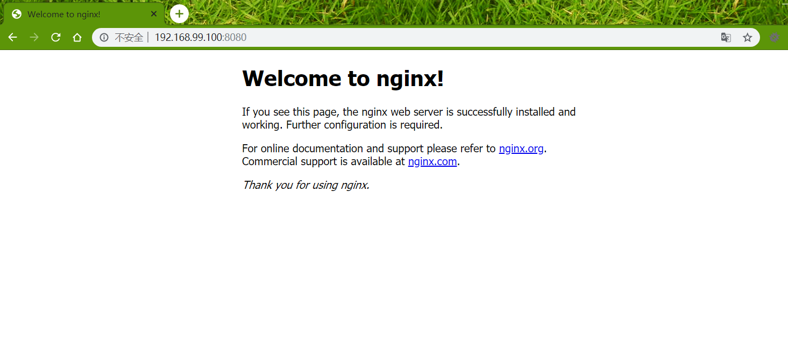
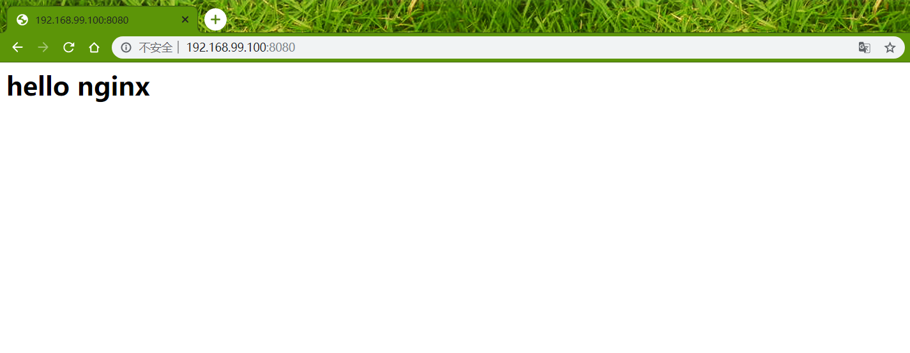
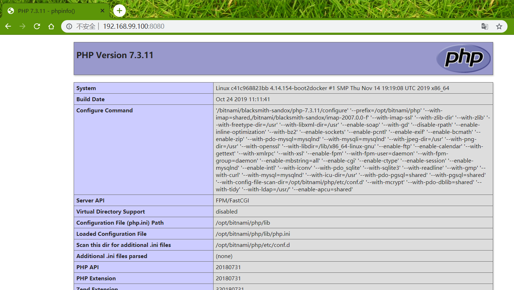

### nginx容器搭建 ###

#### 获取nginx镜像 ####

<!-- more -->

1. 查看nginx镜像
>使用<code>docker search nginx</code>命令查看有哪些nginx镜像
```text
docker@default:~$ docker search nginx
NAME                              DESCRIPTION                                     STARS               OFFICIAL            AUTOMATED
nginx                             Official build of Nginx.                        12220               [OK]                
jwilder/nginx-proxy               Automated Nginx reverse proxy for docker con…   1690                                    [OK]
richarvey/nginx-php-fpm           Container running Nginx + PHP-FPM capable of…   745                                     [OK]
linuxserver/nginx                 An Nginx container, brought to you by LinuxS…   82                                      
bitnami/nginx                     Bitnami nginx Docker Image                      72                                      [OK]
tiangolo/nginx-rtmp               Docker image with Nginx using the nginx-rtmp…   60                                      [OK]
nginxdemos/hello                  NGINX webserver that serves a simple page co…   32                                      [OK]
jc21/nginx-proxy-manager          Docker container for managing Nginx proxy ho…   30                                      
jlesage/nginx-proxy-manager       Docker container for Nginx Proxy Manager        27                                      [OK]
nginx/nginx-ingress               NGINX Ingress Controller for Kubernetes         22                                      
privatebin/nginx-fpm-alpine       PrivateBin running on an Nginx, php-fpm & Al…   19                                      [OK]
schmunk42/nginx-redirect          A very simple container to redirect HTTP tra…   17                                      [OK]
blacklabelops/nginx               Dockerized Nginx Reverse Proxy Server.          12                                      [OK]
centos/nginx-18-centos7           Platform for running nginx 1.8 or building n…   12                                      
raulr/nginx-wordpress             Nginx front-end for the official wordpress:f…   12                                      [OK]
nginxinc/nginx-unprivileged       Unprivileged NGINX Dockerfiles                  10                                      
centos/nginx-112-centos7          Platform for running nginx 1.12 or building …   10                                      
nginx/nginx-prometheus-exporter   NGINX Prometheus Exporter                       8                                       
sophos/nginx-vts-exporter         Simple server that scrapes Nginx vts stats a…   5                                       [OK]
1science/nginx                    Nginx Docker images that include Consul Temp…   5                                       [OK]
mailu/nginx                       Mailu nginx frontend                            4                                       [OK]
pebbletech/nginx-proxy            nginx-proxy sets up a container running ngin…   2                                       [OK]
ansibleplaybookbundle/nginx-apb   An APB to deploy NGINX                          1                                       [OK]
wodby/nginx                       Generic nginx                                   0                                       [OK]
centos/nginx-110-centos7          Platform for running nginx 1.10 or building …   0               
```

2. 获取镜像
>这里选择官方最新镜像，因此直接运行命令<code>docker pull nginx</code>
```text
docker@default:~$ docker pull nginx
Using default tag: latest
latest: Pulling from library/nginx
8d691f585fa8: Pull complete 
5b07f4e08ad0: Pull complete 
abc291867bca: Pull complete 
Digest: sha256:922c815aa4df050d4df476e92daed4231f466acc8ee90e0e774951b0fd7195a4
Status: Downloaded newer image for nginx:latest
docker.io/library/nginx:latest
```

----

#### 创建一个简单的nginx容器 ####

使用命令<code>docker container run</code>命令进行创建：
```text
docker@default:~$ docker container run \                                                                                                            
> -d \      
> -p 8080:80 \
> --name nginxsvr \
> nginx
a15a9bf298594e0e466257117099cf8b35c5f05197d644fb80725fa7557c8639
```

然后通过浏览器http://192.168.99.100:8080/访问nginx服务器，如图：

这种方案进行部署的nginx容器是将供浏览的资源文件放入容器内部的，外部对资源的创建修改很不方便，因此可以通过目录映射的方式将外部资源目录映射到容器内作为nginx的资源目录。

----

#### 将资源目录放在外部 ####

1. 宿主机下创建资源目录html并新建一个index.html:
```text
docker@default:~/nginx/html$ pwd
/home/docker/nginx/html
docker@default:~/nginx/html$ ls                                                                                                                     
index.html
docker@default:~/nginx/html$ cat index.html                                                                                                         
<h1>hello nginx</h1>
docker@default:~/nginx/html$
```
2. 删掉刚才创建的nginx容器，指定html目录重新创建：
```text
docker@default:~/nginx$ docker container run \                                                                                                      
> -d \  
> -v /home/docker/nginx/html:/usr/share/nginx/html \
> -p 8080:80 \
> --name nginxsvr \
> nginx
ba452c50279e91ae20aaca2bd685ec96681c5354d5dc2f6ce6a2e2c6a17e6151
```
3. 然后通过浏览器http://192.168.99.100:8080/访问nginx服务器，如图：
   
   这种方案进行部署的nginx容器只能当做静态资源服务器，如果动态交互则需要进一步升级，下面拿动态web脚本PHP语言为例创建一个nginx + php-fpm的web环境

----

#### nginx + php-fpm 环境 ####

1. 获取<code>php-fpm</code>镜像
```text
docker@default:~/nginx$ docker search php-fpm                                                                                                       
NAME                         DESCRIPTION                                     STARS               OFFICIAL            AUTOMATED
bitnami/php-fpm              Bitnami PHP-FPM Docker Image                    82                                      [OK]
laradock/php-fpm             LaraDock PHP-FPM Base Image                     22                                      [OK]
devilbox/php-fpm             PHP-FPM Docker images based on original PHP …   13                                      
nanoninja/php-fpm            Docker container to install and run PHP-FPM     10                                      [OK]
crunchgeek/php-fpm           Fully loaded PHP-FPM backend with NewRelic &…   10                                      
cytopia/php-fpm-7.1          PHP-FPM 7.1 on CentOS 7                         3                                       [OK]
cytopia/php-fpm-5.6          PHP-FPM 5.6 on CentOS 7                         3                                       [OK]
erdiko/php-fpm               PHP-FPM container for LAMP/LEMP development …   3                                       [OK]
osminogin/php-fpm            Generic PHP-FPM container for your web apps     3                                       [OK]
cytopia/php-fpm-7.0          PHP-FPM 7.0 on CentOS 7                         2                                       [OK]
mpfmedical/php-fpm           php-fpm                                         1                                       [OK]
cytopia/php-fpm-5.4          PHP-FPM 5.4 on CentOS 7                         1                                       [OK]
camil/php-fpm                PHP-FPM docker image with composer. Ready fo…   1                                       [OK]
sazo/php-fpm                 Php-fpm 7 setup with custom modules             1                                       [OK]
liquidweb/php-fpm-docker     PHP FPM                                         1                                       [OK]
dmiseev/php-fpm7.1           Docker image php-fpm7.1                         1                                       [OK]
hipages/php-fpm_exporter     A prometheus exporter for PHP-FPM.              1                                       
wearemobedia/php-fpm         Generic mobedia PHP-FPM runtime                 0                                       [OK]
spritsail/php-fpm            Php-FPM                                         0                                       [OK]
glorian/php-fpm              PHP-FPM 5.6, 7.0, 7.1, Debian Stretch based     0                                       [OK]
invitado/php-fpm             PHP-FPM with logging.                           0                                       [OK]
jenkler/php-fpm              Docker PHP-fpm package                          0                                       
twentyfifth/php-fpm          No longer maintained - please use https://hu…   0                                       
liquidweb/php-fpm_exporter   A prometheus exporter for PHP-FPM.              0                                       
fezzz/php-fpm                php7.3-fpm(latest) image for nextcloud:  Ser…   0                                       [OK]
docker@default:~/nginx$                                                                                                                             
docker@default:~/nginx$ 
docker@default:~/nginx$ docker pull bitnami/php-fpm
Using default tag: latest
latest: Pulling from bitnami/php-fpm
3c9020349340: Pull complete 
40733cd5627a: Pull complete 
94cd6abee637: Pull complete 
5d1a828d2437: Pull complete 
fd7d1147b5d0: Pull complete 
Digest: sha256:1a159e2303ad4a8da9c371ee2c1e35d98ad76a2db80b4686fd8b4415a7c5cc18
Status: Downloaded newer image for bitnami/php-fpm:latest
docker.io/bitnami/php-fpm:latest
docker@default:~/nginx$                     
```

2. 接下来要创建<code>php-fpm</code>容器，首先要明确当访问静态资源时由nginx服务器来处理，当访问php脚本时需要php-fpm来解析，因此需要将本地目录映射到php-fpm容器中
```text
docker@default:~/nginx$ docker container run \                                                                                                      
> -d \
> -v /home/docker/nginx/html:/usr/share/nginx/html \
> -p 9990:9000 \
> --name phpfpm \
> bitnami/php-fpm
c41c968823bb8bc45dc362454a7ceddfa53467e40ff6237e26eded85ea31f16a
```

3. 将nginx配置文件拷贝到宿主机目录方便修改配置文件，然后通过目录映射的方式挂载到nginx容器中
```text
docker@default:~/nginx$ docker container cp nginxsvr:/etc/nginx .
docker@default:~/nginx$ ls                                                                                                                          
nginx
docker@default:~/nginx$ mv nginx conf    
```

4. 修改nginx配置文件，这里注意两点：
>① 访问资源多了一种php脚本，当访问php脚本时nginx服务器将交由fastcgi服务器(php-fpm)来解析
② 创建php-fpm容器时指定了端口和目录映射，在配置文件中需要进行相应的配置
```text
docker@default:~/nginx/conf/conf.d$ cat default.conf 
server {
    listen       80;
    server_name  localhost;

    #charset koi8-r;
    #access_log  /var/log/nginx/host.access.log  main;

    location / {
        root   /usr/share/nginx/html;
        index  index.html index.htm index.php;
    }

    #error_page  404              /404.html;

    # redirect server error pages to the static page /50x.html
    #
    error_page   500 502 503 504  /50x.html;
    location = /50x.html {
        root   /usr/share/nginx/html;
    }

    # proxy the PHP scripts to Apache listening on 127.0.0.1:80
    #
    #location ~ \.php$ {
    #    proxy_pass   http://127.0.0.1;
    #}

    # pass the PHP scripts to FastCGI server listening on 127.0.0.1:9000
    #
    location ~ \.php$ {
        root           html;
        fastcgi_pass   192.168.99.100:9990;
        fastcgi_index  index.php;
    #    fastcgi_param  SCRIPT_FILENAME  /scripts$fastcgi_script_name;
        fastcgi_param  SCRIPT_FILENAME  /usr/share/nginx/html$fastcgi_script_name;
        include        fastcgi_params;
    }

    # deny access to .htaccess files, if Apache's document root
    # concurs with nginx's one
    #
    #location ~ /\.ht {
    #    deny  all;
    #}
}

docker@default:~/nginx/conf/conf.d$ 
```

5. 重新创建nginx容器<code>nginxsvr</code>，html目录下添加index.php脚本文件
```text
docker@default:~/nginx$ docker container run \
> -d \
> -p 8080:80 \
> -v /home/docker/nginx/html:/usr/share/nginx/html \
> -v /home/docker/nginx/conf:/etc/nginx \
> --name nginxsvr \
> nginx
5e8cc201816afedc66c88eb655aaaffce55615efb467656c76ff08cbb0fd87a6
docker@default:~/nginx$ 
docker@default:~/nginx$ cd html/                                                                                                                    
docker@default:~/nginx/html$ cat index.php                                                                                                          
<?php

echo phpinfo()
docker@default:~/nginx/html$  
```

6. 然后通过浏览器http://192.168.99.100:8080/访问nginx服务器，如图：


至此，nginx + php-fpm环境搭建完毕！
