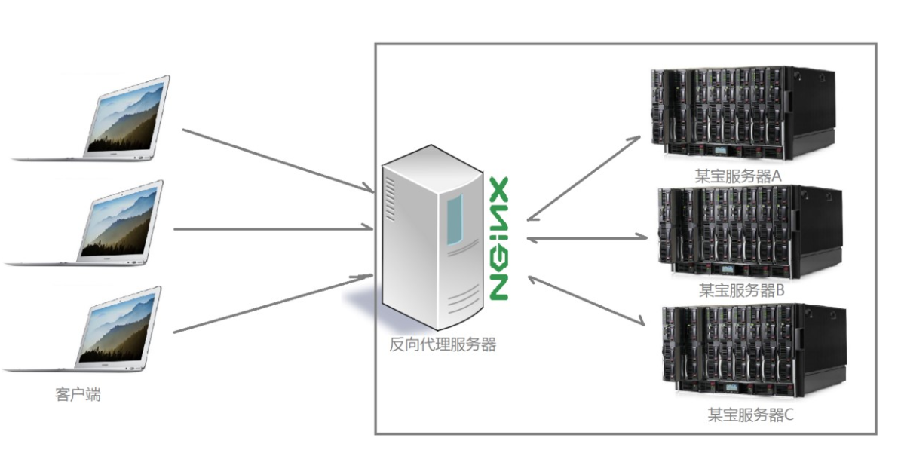
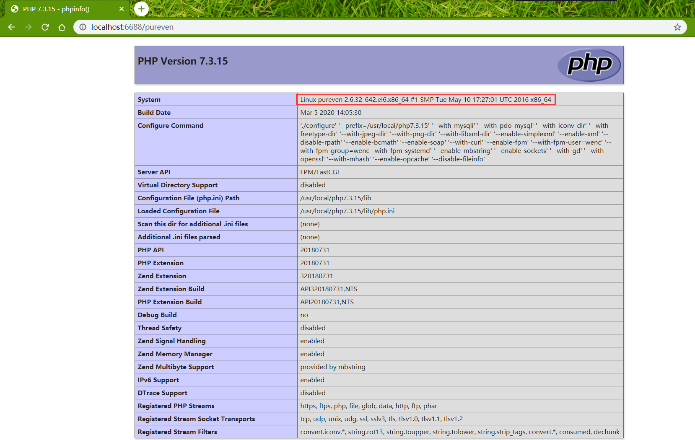

#### 引言 ####

[上文](https://pureven.cc/2020/03/06/nginx-simple-conf-with-php-fpm/)对Windows平台下搭建Nginx + PHP环境做了介绍，通过上文的配置通过`http://localhost:6688/index.php`访问本地的index.php文件。这时index.php文件是通过后端服务器进行解析的，此时Nginx作为代理服务器，本文对Nginx作为代理服务器进行介绍以及一些其他功能。

---

#### 正向代理与反向代理 ####

##### 正向代理 #####

正向代理也是大家最常接触的到的代理模式，我们会从两个方面来说关于正向代理的处理模式，分别从软件方面和生活方面来解释一下什么叫正向代理。比如我们想要访问facebook，但是因为国内的网络环境我们是访问不了的，我们就会去使用一些翻墙工具，帮助我们访问facebook，那么翻墙工具背后实际上就是一个可以访问国外网站的代理服务器，我们将请求发送给代理服务器，代理服务器去访问国外的网站，然后将访问到的数据传递给我们。 

上述这样的代理模式称为正向代理，`正向代理最大的特点是客户端非常明确要访问的服务器地址；服务器只清楚请求来自哪个代理服务器，而不清楚来自哪个具体的客户端；正向代理模式屏蔽或者隐藏了真实客户端信息。`


##### 反向代理 #####

某宝网站，每天同时连接到网站的访问人数已经爆表，单个服务器远远不能满足人民日益增长的购买欲望了，此时就出现了一个大家耳熟能详的名词：`分布式部署，即通过部署多台服务器来解决访问人数限制的问题`；某宝网站中大部分功能也是直接使用`Nginx`进行反向代理实现的。

多个客户端给服务器发送的请求，Nginx服务器接收到之后，按照一定的规则分发给了后端的业务处理服务器进行处理了。此时~请求的来源也就是客户端是明确的，但是请求具体由哪台服务器处理的并不明确了，Nginx扮演的就是一个反向代理角色。

##### 示例 #####

本地是Windows系统，当访问localhost:6688/index.php时结果如下：

此时有一个Linux平台，当通过本地Nginx服务器去代理Linux服务器时步骤如下：
1. 修改本地`nginx.conf`
```yaml
server {
    listen 6688;
    server_name localhost;
    
    location ^~ /pureven {
        proxy_pass http://192.168.31.3:80/index.php;
    }
}
```
2. 修改Linux(192.168.31.3)服务器`nginx.conf`
```yaml
server {
    listen 80;
    server_name localhost;
    
    location ~ \.php$ {
        root html; 
        fastcgi_pass 127.0.0.1:16688;
        fastcgi_index index.php;
        fastcgi_param SCRIPT_FILENAME $document_root$fastcgi_script_name;
        include fastcgi_params;
    }
}
```
修改Linux(192.168.31.3)服务器`www.conf`
```yaml
listen = 16688
```
3. 浏览器访问`localhost:6688/pureven`


4. proxy_pass使用方法参考[proxy_pass url 反向代理的坑](https://xuexb.github.io/learn-nginx/example/proxy_pass.html#url-%E5%8F%AA%E6%98%AF-host)。

---

#### 负载均衡 ####

**当我们的应用单例不能支撑用户请求时，此时就需要扩容，从一台服务器扩容到两台、几十台、几百台，我们需要一个入口，将客户端请求均衡分布在后台的多个服务器上。负载均衡在服务端开发中算是一个比较重要的特性，Nginx提供的负载均衡可以实现`上游服务器的负载均衡`、`故障转移`、`失败重试`、`容错`、`健康检查`，当某些上游服务器出现问题时，可以将请求转到其它的上游服务器从而保障高可用。**

##### upstream指令 #####

Nginx通过如下配置负载均衡到真实的处理业务的服务器(即`上游服务器`)：
```yaml
upstream backend {
    server backend1.example.com       weight=5;
    server backend2.example.com:8080;
    server unix:/tmp/backend3;

    server backup1.example.com:8080   backup;
    server backup2.example.com:8080   backup;
}

server {
    location / {
        proxy_pass http://backend;
    }
}
```
`upstream`指令当中包含`server`指令
```yaml
语法:	server address [parameters];
默认值:	—
上下文:	upstream
```
下面介绍部分parameters:
- **weight**: 设定服务器的`权重`，默认是1，权重越大被访问机会越大，要根据机器的配置情况来配置
- **max_fails**: 设定Nginx与服务器通信的`尝试失败的次数`。在`fail_timeout`参数定义的时间段内，如果失败的次数达到此值，Nginx就认为服务器不可用。在下一个fail_timeout时间段，服务器不会再被尝试。 失败的尝试次数默认是1。可以通过指令`proxy_next_upstream` 和`memcached_next_upstream`来配置什么是失败的尝试。 `默认配置时，http_404状态不被认为是失败的尝试`。
- **fail_timeout**: `统计失败尝试次数的时间段`。在这段时间中，服务器失败次数达到指定的尝试次数，服务器就被认为不可用。默认情况下，该超时时间是10秒。
- **backup**: 标记为`备用服务器`。当主服务器不可用以后，请求会被传给这些服务器，配置这个指令可以实现故障转移。
- **down**: 标记服务器`永久不可用`，可以跟`ip_hash`指令一起使用。

##### 负载均衡机制 #####

###### 轮询 ######
默认的轮询方式，即每一个来自网络中的请求，轮流分配给内部的服务器，从1到N然后重新开始。此种负载均衡算法适合`服务器组内部的服务器都具有相同的配置并且平均服务请求相对均衡的情况。`

###### 加权轮询 ######
通过`weight`参数控制权重，根据服务器的不同处理能力，给每个服务器分配不同的权值，使其能够接受相应权值数的服务请求。例如：服务器A的权值被设计成1，B的权值是3，C的权值是6，则服务器A、B、C将分别接受到10%、30％、60％的服务请求。`此种均衡算法能确保高性能的服务器得到更多的使用率，避免低性能的服务器负载过重。`

###### IP Hash ###### 
在upstream当中配置ip_hash;
这种方式通过生成请求源IP的哈希值，并通过这个哈希值来找到正确的真实服务器。这意味着对于同一主机来说他对应的服务器总是相同。使用这种方式，你不需要保存任何源IP。将客户端会话"沾住"或者"持久化"，以便总是能选择特定服务器，那么可以使用ip-hash负载均衡机制。`使用ip-hash时，客户端IP地址作为hash key使用，用来决策选择服务器集群中的哪个服务器来处理这个客户端的请求。这个方法保证从同一个客户端发起的请求总是定向到同一台服务器，除非服务器不可用。`
```yaml
upstream backend{
    ip_hash;
    server 192.168.128.1:8080 ;
    server 192.168.128.2:8080 ;
    server 192.168.128.3:8080 down;
    server 192.168.128.4:8080 down;
}
server {
    listen 8081;
    server_name test.csdn.net;
    root /home/system/test.csdn.net/test;
    location ^~ /Upload/upload {
        proxy_pass http://backend;
    }
}
```

当你服务端的一个特定url路径会被同一个用户连续访问时，如果负载均衡策略还是轮询的话，那该用户的多次访问会被打到各台服务器上，**这显然并不高效（会建立多次http链接等问题）**。甚至考虑一种极端情况，**用户需要分片上传文件到服务器下，然后再由服务器将分片合并，这时如果用户的请求到达了不同的服务器，那么分片将存储于不同的服务器目录中，导致无法将分片合并**。所以，此类场景可以考虑采用nginx提供的ip_hash策略。既能满足每个用户请求到同一台服务器，又能满足不同用户之间负载均衡。

###### 最少连接数 ######
在upstream当中配置least_conn实现最少连接数，客户端的每一次请求服务在服务器停留的时间可能会有较大的差异，随着工作时间加长，如果采用简单的轮循或随机均衡算法，每一台服务器上的连接进程可能会产生极大的不同，并没有达到真正的负载均衡。`最少连接数均衡算法对内部中需负载的每一台服务器都有一个数据记录，记录当前该服务器正在处理的连接数量，当有新的服务连接请求时，将把当前请求分配给连接数最少的服务器，使均衡更加符合实际情况，负载更加均衡。`
```yaml
upstream backend {
    server backend1.example.com weight=5;
    server backend2.example.com:8080;
}
upstream backend {
    ip_hash;   #哈希
    least_conn; #最少连接数
    server  nginx.23673.com:9502 max_fails=3 fail_timeout=5s;
    server  nginx.23673.com:9503 backup max_fails=3 fail_timeout=5s;
    server  nginx.23673.com:9503 down max_fails=3 fail_timeout=5s;
    server  nginx.23673.com:9502 max_fails=3 fail_timeout=5s;
    server  nginx.23673.com:9502 max_fails=3 fail_timeout=5s;
}
```

###### URL Hash ######

一般来讲，要用到url hash，是要配合缓存命中来使用。例如：有一个服务器集群A，需要对外提供文件下载，由于文件上传量巨大，没法存储到服务器磁盘中，所以用到了第三方云存储来做文件存储。服务器集群A收到客户端请求之后，需要从云存储中下载文件然后返回，为了省去不必要的网络带宽和下载耗时，在服务器集群A上做了一层临时缓存（缓存一个月）。**由于是服务器集群，所以同一个资源多次请求，可能会到达不同的服务器上，导致不必要的多次下载，缓存命中率不高，以及一些资源时间的浪费**。在此类场景下，`为了使得缓存命中率提高，很适合使用url_hash策略，同一个url（也就是同一个资源请求）会到达同一台机器，一旦缓存住了资源，再此收到请求，就可以从缓存中读取，既减少了带宽，也减少的下载时间。`
```yaml
upstream somestream {
    hash $request_uri;
    server 192.168.244.1:8080;
    server 192.168.244.2:8080;
    server 192.168.244.3:8080;
    server 192.168.244.4:8080;
}
server {
    listen 8081 default;
    server_name test.csdn.net;
    charset utf-8;
    location /get {
        proxy_pass http://somestream;
    }  
}
```

---

#### 失败重试 ####

##### 作用 #####

通过配置上游服务器`max_fails`和`fail_timeout`，指定每个上游服务器，当fail_timeout时间内失败了max_fails次请求，则认为该上游服务器不可用/不存活，然后这段时间将不会访问这台上游服务器，fail_timeout时间后会再次进行重试。
max_fails=2 fail_timeout=30s 这2个一起搭配使用表示`当失败2次的时候，就停止使30秒`，`这样既可以避免重复请求，不能访问或者暂时不能访问的服务，增大服务器的压力，也可以灵活的做到当服务器可用时再次访问。`

`proxy_next_upstream`定义了什么情况下算作请求失败
```yaml
语法: proxy_next_upstream error | timeout | invalid_header | http_500 | http_502 http_503 | http_504 |http_404 | off ...; 
默认值: proxy_next_upstream error timeout; 
上下文: http, server, location
```
- **error** 表示和后端服务器建立连接时，或者向后端服务器发送请求时，或者从后端服务器接收响应头时，出现错误。
- **timeout** 表示和后端服务器建立连接时，或者向后端服务器发送请求时，或者从后端服务器接收响应头时，出现超时。
- **invalid_header** 表示后端服务器返回空响应或者非法响应头。
- **http_500** 表示后端服务器返回的响应状态码为500。
- **off** 表示停止将请求发送给下一台后端服务器。

**重试不能无限制进行，因此，需要控制重试次数和重试超时时间的指令。**
```yaml
# 设置重试次数，默认0表示不限制，注意此重试次数指的是所有请求次数（包括第一次和之后的重试次数之和）。
proxy_next_upstream_tries number 

# 设置重试最大超时时间，默认0表示不限制，即在proxy_next_upstream_timeout时间内允许proxy_next_upstream_tries次重试。
# 如果超过了其中一个设置，则Nginx也会结束重试并返回客户端响应（可能是错误码）。
proxy_next_upstream_timeout time 

# 后端服务器数据回传时间(代理发送超时时间)
proxy_send_timeout 

# 连接成功后，后端服务器响应时间(代理接收超时时间)
proxy_read_timeout 

# nginx连接后端的超时时间，一般不超过75s
proxy_connect_timeout 
```

##### 示例 #####
```yaml
location / {
    #proxy_next_upstream timeout; #超时切换到下一台服务器,注意备用服务器切换问题
    #超时时间
    proxy_connect_timeout 20;
    proxy_send_timeout 30;
    proxy_read_timeout 30;
    proxy_next_upstream_tries 1; #代理请求的重试次数
    proxy_next_upstream_timeout 1; #重试的超时时间
    proxy_pass   http://backend;
}
```

#### 访问控制 ####

基于IP的访问控制，基于Nginx的http_access_module模块，是Nginx本身内置的模块，不需要安装的时候配置。也就是允许哪些IP访问，不允许哪些IP访问。

```yaml
server {
  listen       80;
  server_name example.com;
  access_log logs/access.log main;

  location / {
       deny 192.168.1.1;
       allow 192.168.1.0/24;
       allow 10.1.1.0/16;
       allow 2001:0db8::/32;
       deny all;
  }
}
```
从上到下的顺序，类似iptables。匹配到了便跳出。如上的例子先禁止了192.16.1.1，接下来允许了3个网段，其中包含了一个ipv6，最后未匹配的IP全部禁止访问.被deny的将返回403状态码。

```yaml
server {
  listen       80;
  server_name example.com;
  access_log logs/access.log main;

  location ~ ^/phpmyadmin/ {
      allow 192.168.1.0/24;
      deny all;
  }
}
```
只允许局域网访问。

```yaml
server {
  listen       80;
  server_name example.com;
  access_log logs/access.log main;
   location /project {  
       allow   220.178.25.22;  
       allow   172.2.2.0/24;  
       allow   192.2.2.0/24;  
       deny    all;  
       proxy_pass http://172.2.2.20:8080/project/;  
       proxy_set_header   Host    $host:$server_port;  
       proxy_set_header   X-Real-IP   $remote_addr;   
       proxy_set_header   X-Forwarded-For $proxy_add_x_forwarded_for;  
       client_max_body_size    10m;  
   }
}
```
以上配置的作用是允许IP为220.178.25.22，以及172和192网段的机器可以访问这个location地址，其他IP的客户端访问均是403。其中，24是指子网掩码为255.255.255.0。

#### 防盗链 ####

##### 原理 #####

盗链是一种损害原有网站合法利益，给原网站所在服务器造成额外负担的非法行为。要采取防盗链的措施，首先需要了解盗链的实现原理。 客户端向服务器请求资源时，为了减少网络带宽，提高响应时间，服务器一般不会一次将所有资源完整地传回给客户端。比如在请求一个网页时，首先会传回该网页的文本内容，当客户端浏览器在解析文本的过程中发现有图片存在时，会再次向服务器发起对该图片资源的请求，服务器将存储的图片资源再发送给客户端。在这个过程中，如果该服务器上只包含了网页的文本内容，并没有存储相关的图片资源，而是将图片资源链接到其他站点的服务器上去了，这就形成了盗链行为。

比如内网用户通过Internet访问域名为`www.test.com`这个服务器上的WEB服务，而该服务器没有存储图片资源，而是将图片链接到域名为`www.fz.com`服务器上，这就形成了盗链行为。这种情况下客户端请求图片资源实际上是来自其他的服务器。`要实现防盗链，需要了解HTTP协议中的请求头部的Referer头域和采用URL的格式表示访问当前网页或者文件的源地址。通过该头域的值，我们可以检测到访问目标资源的源地址。这样，如果我们检测到Referer头域中的值并不是自己站点内的URL，就采取组织措施，实现防盗链。`**需要注意是，由于Referer头域中的值可以被更改的，因此该方法不能完全阻止所有盗链行为。**

##### 指令 #####

一般来说，遵照HTTP协议实现的浏览器，在从A网站访问B网站时，都会带上当前网站的URL，以表明此次点击是从何而起的。因此， Nginx的这个模块也是依靠这个来实现，所以，如果不加此头部，还是没法愉快的防盗图。

Nginx配置中有一个指令`valid_referers`，用来获取Referer头域中的值，并且根据该值的情况给Nginx全局变量`$invalid_referer`的值，`如果Referer头域中没有符合valid_referers指令配置的值，$invalid_referer变量将会被赋值为1`。

```yaml
语法: valid_referers none | blocked | server_names | string ...;
默认值: —
上下文: server, location
```
- `none` 请求标头中缺少`Referer`字段，也就是说Referer为空，`浏览器直接访问的时候Referer一般为空`。比如直接从浏览器输入资源的链接地址访问资源时没有`Referer头域`的。
- `blocked` `Referer`字段出现在请求标头中，但其值已被防火墙或代理服务器删除; 这些值是不以`http://` 或 `https://` 开头的字符串。
- `server_names` 服务器名称，也就是域名列表。设置一个或多个URL,检测`Referer头域`的值是否是域名列表中的某个。从nginx 0.5.33以后支持使用通配符`*`。

##### 示例 #####
```yaml
location ~* ^.+\.(jpg|gif|png|swf|flv|wma|wmv|asf|mp3|mmf|zip|rar)$ {
    valid_referers none blocked www.pureven.com pureven.com server_names ~\.google\.;
    if ($invalid_referer) {
       return 404;
       # rewrite ^/ http://www.pureven.com/404.jpg;
     }
}
```
以上所有来自`pureven.com`和域名中包含`google`的站点都可以访问当前站点的图片。
1. 如果域名不在这个列表中，那么`$invalid_referer`的值为`1`，在if语句中返回404给用户，如果使用下面的`rewrite`，那么会返回一个404含义的图片。
2. 如果用户直接在浏览器中输入资源的地址是可以访问该资源的，因为符合`none`的规则，即Referer头域不存在。

#### 未完待续 ####

根据学习进展不定期更新。
