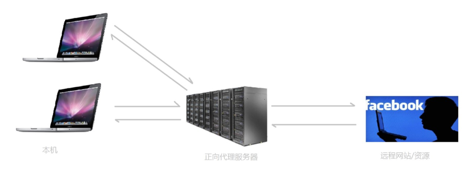

#### 引言 ####

[上文](https://pureven.cc/2020/03/06/nginx-simple-conf-with-php-fpm/)对Windows平台下搭建Nginx + PHP环境做了介绍，通过上文的配置通过`http://localhost:6688/index.php`访问本地的index.php文件。这时index.php文件是通过后端服务器进行解析的，此时Nginx作为代理服务器，本文对Nginx作为代理服务器进行介绍以及一些其他功能。

---

#### 正向代理与反向代理 ####

##### 正向代理 #####

正向代理也是大家最常接触的到的代理模式，我们会从两个方面来说关于正向代理的处理模式，分别从软件方面和生活方面来解释一下什么叫正向代理。比如我们想要访问facebook，但是因为国内的网络环境我们是访问不了的，我们就会去使用一些翻墙工具，帮助我们访问facebook，那么翻墙工具背后实际上就是一个可以访问国外网站的代理服务器，我们将请求发送给代理服务器，代理服务器去访问国外的网站，然后将访问到的数据传递给我们。 

上述这样的代理模式称为正向代理，`正向代理最大的特点是客户端非常明确要访问的服务器地址；服务器只清楚请求来自哪个代理服务器，而不清楚来自哪个具体的客户端；正向代理模式屏蔽或者隐藏了真实客户端信息。`


##### 反向代理 #####

某宝网站，每天同时连接到网站的访问人数已经爆表，单个服务器远远不能满足人民日益增长的购买欲望了，此时就出现了一个大家耳熟能详的名词：分布式部署；也就是通过部署多台服务器来解决访问人数限制的问题；某宝网站中大部分功能也是直接使用nginx进行反向代理实现的。

多个客户端给服务器发送的请求，Nginx服务器接收到之后，按照一定的规则分发给了后端的业务处理服务器进行处理了。此时~请求的来源也就是客户端是明确的，但是请求具体由哪台服务器处理的并不明确了，Nginx扮演的就是一个反向代理角色。

##### 示例 #####

本地是Windows系统，当访问localhost:6688/index.php时结果如下：

此时有一个Linux平台，当通过本地Nginx服务器去代理Linux服务器时步骤如下：
1. 修改本地`nginx.conf`
```yaml
server {
    listen 6688;
    server_name localhost;
    
    location ^~ /pureven {
        proxy_pass http://192.168.31.3:80/index.php;
    }
}
```
2. 修改Linux(192.168.31.3)服务器`nginx.conf`
```yaml
server {
    listen 80;
    server_name localhost;
    
    location ~ \.php$ {
        root html; 
        fastcgi_pass 127.0.0.1:16688;
        fastcgi_index index.php;
        fastcgi_param SCRIPT_FILENAME $document_root$fastcgi_script_name;
        include fastcgi_params;
    }
}
```
修改Linux(192.168.31.3)服务器`www.conf`
```yaml
listen = 16688
```
3. 浏览器访问`localhost:6688/pureven`


4. proxy_pass使用方法参考[proxy_pass url 反向代理的坑](https://xuexb.github.io/learn-nginx/example/proxy_pass.html#url-%E5%8F%AA%E6%98%AF-host)。


---

未完待续
