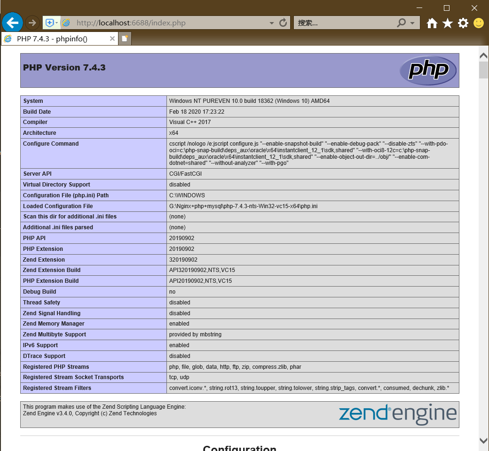
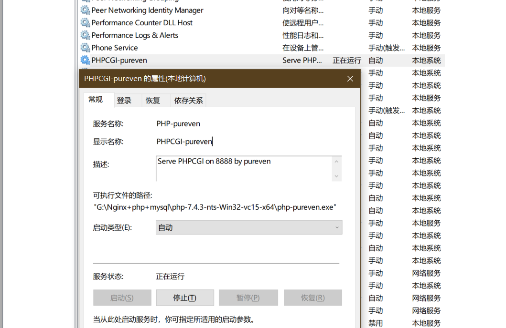

#### 引言 ####

[上一篇](https://pureven.cc/2020/02/29/nginx-simple-conf-with-static-site/)学习了Nginx配置文件中的基本指令，然后配置了一个静态网站。通过这个网站可以访问指定目录中的静态资源，但是如果向php脚本这样的文件还是无法访问，这是因为php脚本只能由特定的解析器(php解析器)来解析，本文学习Win10环境下配置Nginx和PHP-FPM的环境然后通过Nginx来访问指定目录中的动态资源(php脚本)。

<!-- more -->

---

#### PHP下载 ####

下载PHP的**非线程安全版本：**[php-7.4.3-nts-Win32-vc15-x64.zip](https://windows.php.net/download#php-7.4-nts-vc15-x64)。

##### 关于线程安全和非线程安全 #####

Windows版的PHP从版本5.2.1开始有`Thread Safe`。这两者不同在于何处？到底应该用哪种？这里做一个简单的介绍。

从2000年10月20日发布的第一个Windows版的PHP3.0.17开始的都是线程安全的版本，这是由于与Linux/Unix系统是采用`多进程`的工作方式不同的是Windows系统是采用`多线程`的工作方式。如果在IIS下以CGI方式运行PHP会非常慢，这是由于CGI模式是建立在多进程 的基础之上的，而非多线程。一般我们会把PHP配置成以`ISAPI`的方式来运行，ISAPI是多线程的方式，这样就快多了。但存在一个问题，很多常用的 PHP扩展是以Linux/Unix的多进程思想来开发的，这些扩展在ISAPI的方式运行时就会出错搞垮IIS。而用线程安全版本的话顶多只是搞跨某个 线程，而不会影响到整个IIS的安全。
    
当然在IIS下CGI模式才是 PHP运行的最安全方式，但CGI模式对于每个HTTP请求都需要重新加载和卸载整个PHP环境，其消耗是巨大的。为了兼顾IIS下PHP的效率和安全， 有人给出了FastCGI的解决方案。FastCGI可以让PHP的进程重复利用而不是每一个新的请求就重开一个进程。同时FastCGI也可以允许几个 进程同时执行。这样既解决了CGI进程模式消耗太大的问题，又利用上了CGI进程模式不存在线程安全问题的优势。

`因此，如果是使用ISAPI的方式来运行PHP就必须用Thread Safe(线程安全)的版本；而用FastCGI模式运行PHP的话就没有必要用线程安全检查了，用None Thread Safe(NTS，非线程安全)的版本能够更好的提高效率。`

---

#### PHP配置 ####

1. 进入`php-7.4.3-nts-Win32-vc15-x64`目录，拷贝一份`php.ini-development`并将文件名修改为`php.ini`。
2. 修改`php.ini`:
```yaml
; On windows:
extension_dir = "G:\Nginx+php+mysql\php-7.4.3-nts-Win32-vc15-x64\ext"

extension=curl
extension=mbstring
extension=exif      ; Must be after mbstring as it depends on it
extension=mysqli
extension=pdo_mysql

; http://php.net/cgi.fix-pathinfo
cgi.fix_pathinfo=1

[Date]
; Defines the default timezone used by the date functions
; http://php.net/date.timezone
date.timezone = 'Asia/Shanghai'
```

---

#### Nginx配置 ####
```yaml

listen       6688;
server_name  localhost;
# pass the PHP scripts to FastCGI server listening on 127.0.0.1:8888
#
location ~ \.php$ {
    root           G:\Nginx+php+mysql\html;
    fastcgi_pass   127.0.0.1:8888;
    fastcgi_index  index.php;
    fastcgi_param SCRIPT_FILENAME $document_root$fastcgi_script_name;
    include        fastcgi_params;
}
```

---

#### 开启PHP-fpm服务 ####

```yaml
[G:\Nginx+php+mysql]$ cd php-7.4.3-nts-Win32-vc15-x64
[G:\Nginx+php+mysql\php-7.4.3-nts-Win32-vc15-x64]$ php-cgi.exe -b 127.0.0.1:8888 -c php.ini
```

---

#### 重启Nginx ####
```yaml
[G:\Nginx+php+mysql\nginx-1.17.8]$ nginx.exe -s reload
```

---

#### 测试 ####

1. 创建index.php文件
```yaml
[G:\Nginx+php+mysql]$ cd html
[G:\Nginx+php+mysql\html]$ dir
 驱动器 G 中的卷是 研发专用
 卷的序列号是 5861-182A

 G:\Nginx+php+mysql\html 的目录

2020/03/06  08:51    <DIR>          .
2020/03/06  08:51    <DIR>          ..
2020/01/21  21:39               494 50x.html
2020/03/06  08:51    <DIR>          ci
2020/01/21  21:39               612 index.html
2020/03/06  14:24                24 index.php
               3 个文件          1,130 字节
               3 个目录 31,849,316,352 可用字节

[G:\Nginx+php+mysql\html]$ type index.php
<?php

echo phpinfo();
[G:\Nginx+php+mysql\html]$ 
```
2. 访问index.php


---

#### 将PHP-fpm注册为服务 ####

下面介绍使用<code>winsw</code>将nginx加入到windows服务的操作流程：
1. 下载[winsw](https://github.com/kohsuke/winsw/releases/tag/winsw-v2.2.0),目前稳定版为<code>winsw-v2.2.0</code>，本例下载的为<code>WinSW.NET2.exe</code>
2. 将<code>WinSW.NET2.exe</code>重命名为<code>php-pureven.exe</code>并放入与<code>php-cgi.exe</code>相同目录下
3. 新建配置文件<code>php-pureven.xml</code>，参考[这里](https://github.com/kohsuke/winsw/blob/master/doc/xmlConfigFile.md)进行配置，本例配置信息为：
```xml
<configuration>
  <!-- ID of the service. It should be unique accross the Windows system-->
  <id>PHP-pureven</id>
  <!-- Display name of the service -->
  <name>PHPCGI-pureven</name>
  <!-- Service description -->
  <description>Serve PHPCGI on 8888 by pureven</description>
  
  <!-- Path to the executable, which should be started -->
  <executable>G:\Nginx+php+mysql\php-7.4.3-nts-Win32-vc15-x64\php-cgi.exe</executable>

  <onfailure action="restart" delay="20 sec"/>

  <arguments>-b 127.0.0.1:8888 -c "G:\Nginx+php+mysql\php-7.4.3-nts-Win32-vc15-x64\php.ini"</arguments>

  <!--
  <startarguments>-b 127.0.0.1:8888 -c "G:\Nginx+php+mysql\php-7.4.3-nts-Win32-vc15-x64\php.ini"</startarguments>
  -->
  
  <priority>Normal</priority>

  <stoptimeout>30 sec</stoptimeout>

  <stopparentprocessfirst>false</stopparentprocessfirst>

  <stopexecutable>taskkill</stopexecutable>

  <stoparguments>/f /IM php-cgi.exe</stoparguments>-->

  <startmode>Automatic</startmode>
  <!--
  <delayedAutoStart/>
  -->

  <waithint>15 sec</waithint>

  <sleeptime>1 sec</sleeptime>
  
  <logpath>G:\Nginx+php+mysql\php-7.4.3-nts-Win32-vc15-x64\logs</logpath>
  <log mode="roll-by-size">
    <sizeThreshold>10240</sizeThreshold>
    <keepFiles>8</keepFiles>
  </log>

  <env name="PHP_FCGI_MAX_REQUESTS" value="3000" />
  <env name="PHP_FCGI_CHILDREN" value="12" />
  <env name="CI_ENV" value="production" />

  <beeponshutdown/>

</configuration>
```
4. 管理员权限通过cmd终端运行<code>php-pureven.exe install</code>
```text
G:\Nginx+php+mysql\php-7.4.3-nts-Win32-vc15-x64>php-pureven.exe install
2020-03-06 15:26:50,233 INFO  - Installing the service with id 'PHP-pureven'
```
5. 加入服务成功，如图：

6. 启动停止可通过服务界面直接操作了，另外配置文件中设置了开机自启，上图可以看到，至此设置完毕！

---

#### Linux下安装配置Nginx + PHP-fpm ####

请参考[Nginx中文官方文档-nginx php-fpm安装配置](https://wizardforcel.gitbooks.io/nginx-doc/content/Text/6.5_nginx_php_fpm.html)
