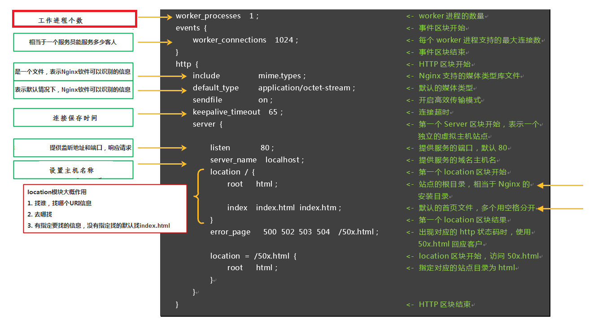
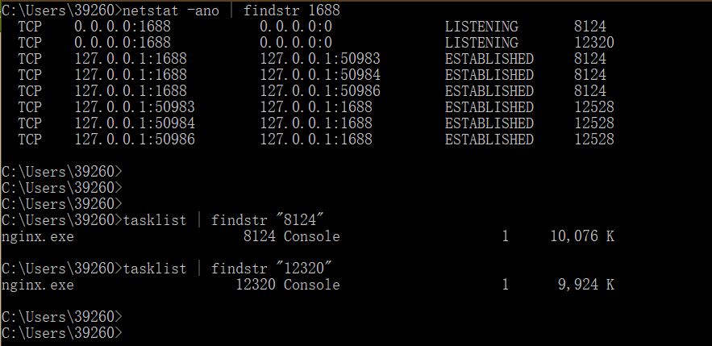

#### 引言 ####
本文为nginx.conf文件中配置指令学习的相关笔记，并试着配置了一个静态网站。本文介绍：
- nginx.conf文件结构
- 配置允许允许Nginx服务器的用户和用户组
- 配置允许生成的worker process数
- 配置Nginx服务器的错误日志
- 设置网络连接的序列化
- 设置是否允许同时接收多个网络连接
- 选择事件驱动模型
- 配置最大连接数
- 引入文件配置
- 配置默认处理前端请求的MIME类型
- 设置服务日志的格式、大学、输出及Nginx服务日志
......

<!-- more -->

---

#### nginx.conf文件结构 ####


nginx.conf一共由三部分组成，分别为`全局块`、`events块`和`http块`。在http块中，又包含http全局块、多个server块。每个server块中，可以包含server全局块和多个location块。在同一配置块中嵌套的配置块，各个之间不存在次序关系。

配置文件支持大量可配置的指令，绝大多数指令不是特定属于某一个块的。同一个指令放在不同层级的块中，其作用域也不同，一般情况下，高一级块中的指令可以作用于自身所在的块和此块包含的所有低层级块。如果某个指令在两个不同层级的块中同时出现，则采用“**就近原则**”，即`以较低层级块中的配置为准`。比如，某指令同时出现在http全局块中和server块中，并且配置不同，则应该以server块中的配置为准。

---

#### 全局块 ####

##### 配置允许运行Nginx服务器的用户和用户组 #####
```yaml
user  nobody;
```
- 配置允许运行Nginx服务器的用户和用户组， `user user [group];`
- 只有被设置的用户或用户组成员才有权限启动Nginx进程，如果是其他用户尝试启动Nginx进程则报错
- 如果希望所有用户都可以启动Nginx进程则将此指令注释掉或者将用户(和用户组)设置为nobody

##### 配置允许生成的worker process数 #####
```yaml
worker_processes  2;
```
- 配置允许生成的worker process数的指令， `worker_process number | auto;`
- number 表示指定Nginx进程最多可以产生的workder process数; auto 表示Nginx进程将自动检测;
- number值理论上越大可支持的并发处理量越多，但实际上会受到来自软件本身、操作系统本身资源和能力、硬件设备(CPU和磁盘驱动器)的制约

##### 配置错误输出 #####
```yaml
#error_log  logs/error.log;
#error_log  logs/error.log  notice;
#error_log  logs/error.log  info;
```
- `err_log file | stderr [debug | info | notice | warn | error | crit | alert | emerg];`，Nginx服务器的日志支持输出到某一固定的文件或输出到标准错误输出stderr;日志级别是可选项;
- 全局快、http块和server块中都可以对Nginx服务器的日志进行相关配置; 

##### 示例 #####
```yaml
#user  nobody; 

worker_processes  2;

#error_log  logs/error.log;
#error_log  logs/error.log  notice;
#error_log  logs/error.log  info;

# pid file; 用于保存当前运行程序的主进程号;
#pid        logs/nginx.pid;
```
全局块是默认配置文件从开始到events块之间的一部分内容，主要设置一些影响`Nginx服务器整体运行的配置指令`，因此，这些指令的作用域是Nginx服务器全局。
通常包括配置运行Nginx服务器的用户（组）、允许生成的worker process数、Nginx进程PID存放路径、日志的存放路径和类型以及配置文件引入等。

---

`worker_process 2`表示Nginx进程最多产生两个worker进程，Windows下可利用`netstat -ano | findstr 8080`通过端口号查看进程PID和`tasklist | findstr $PID`通过PID查看进程。


---

#### events块 ####

##### 设置网络连接的序列化 #####
```yaml
accept_mutex on | off;
```
- 设置网络连接的序列化，当开启时将会对多个Nginx进程接收连接进行序列化，防止多个进程对连接的争抢，杜绝**惊群**问题; 默认on;

##### 设置是否允许同时接受多个网络连接 #####
```yaml
multi_accept on | off;
```
- 设置是否允许同时接受多个网络连接。默认off，即每个worker process一次只能接受一个新到达的网络连接

##### 选择事件驱动模型 #####
```yaml
use epoll;
```
- 选择事件驱动模型: `use method;` 其中method可选择select、poll、kqueue、epoll、rtsig、/dev/poll以及eventport。

##### 配置最大连接数 #####
```yaml
worker_connections  1024; 
```
- 配置最大连接数，用来设置允许每一个worker process同时开启的最大连接数: `worker_connections number;`，number值不能大于操作系统支持打开的最大文件句柄数量;

##### 示例 #####
```yaml
events {
    # accept_mutex on | off;
    
    # multi_accept on | off;
    
    # use epoll; 
    
    worker_connections  1024; 
}
```
events块涉及的指令主要影响Nginx服务器与用户的网络连接。常用到的设置包括是否开启对多worker process下的网络连接进行序列化，是否允许同时接收多个网络连接，选取哪种事件驱动模型处理连接请求，每个worker process可以同时支持的最大连接数等。

---

#### http块 ####

##### 引入配置文件 #####
```yaml
include mime.types; # 定义MIME-Type;
default_type  application/octet-stream;
```
- 引入配置文件: `include file;`可以在任意地方引入;
- 可在http块、server块或者location块中进行配置;
- 配置用于处理前端请求的MIME类型，结构: `default_type mime-type;`默认`text/plain;`

##### 设置服务日志的格式、大小、输出等和设置Nginx服务日志 #####
```yaml
log_format  main  '$remote_addr - $remote_user [$time_local] "$request" '
                  '$status $body_bytes_sent "$http_referer" '
                  '"$http_user_agent" "$http_x_forwarded_for"';
access_log  logs/access.log  main;
```
- 设置Nginx服务日志，即用于存放前端请求的日志;格式为`access_log path [format [buffer=size]];`
- 可在http块、server块或者location块中进行配置;默认的配置为: `access_log logs/access.log combined;`

##### 用于开启或关闭使用sendfile()传输文件 #####
```yaml
sendfile        on;
```
- 用于开启或关闭使用sendfile()传输文件;可在http块、server块或者location块中进行配置;

##### 设置worker process进程每次调用sendfile()传输数据量上限 #####
```yaml
sendfile_max_chunk 0;
```
- `sendfile_max_chunk size;`用于设置Nginx进程的每个worker process每次调用`sendfile()`传输的数据量最大不能超过这个值;`如果为0则表示无限制;`
- 可在http块、server块或者location块中进行配置;

##### 配置连接超时时间 #####
```yaml
keepalive_timeout  65;
```
- 配置连接超时时间: `keepalive_timeout  timeout [header_timeout]; `，即与用户建立会话连接后可以保持这些连接持续打开的时间。
- **header_timeout** 为可选项，表示在应答报文头部的`Keep-Alive`域设置超时时间: `"Keep-Alive:timeout=header_timeout"`，比如: `keepalive_timeout 120 100;`
- 可在http块、server块或者location块中进行配置;

##### 单连接请求数上限 #####
```yaml
keepalive_requests 100;
```
- 单连接请求数上限: `keepalive_requests number;`，用于限制用户通过某一连接向Nginx服务器发送请求的次数;
- 可在http块、server块或者location块中进行配置;

##### 示例 #####
```yaml
http {
    include mime.types;
    default_type  application/octet-stream;
    
    #log_format  main  '$remote_addr - $remote_user [$time_local] "$request" '
    #                  '$status $body_bytes_sent "$http_referer" '
    #                  '"$http_user_agent" "$http_x_forwarded_for"';

    access_log  logs/access.log  main;

    sendfile        on;
    sendfile_max_chunk 0;
    
    #tcp_nopush     on;

    keepalive_timeout  65;
    keepalive_requests 100;

    #gzip  on;

    server {
        ......
    }
}
```
http块是Nginx服务器配置中的重要部分，`代理`、`缓存`和`日志定义`等绝大多数的功能和`第三方模块的配置`都可以放在这个模块中。http块中可以包含自己的全局块，也可以包含`server块`，server块中又可以进一步包含location块，“http全局块”用来表示http中自己的全局块，即http块中不包含在server块中的部分。可以在http全局块中配置的指令包括`文件引入`、`MIME-Type定义`、`日志自定义`、`是否使用sendfile传输文件`、`连接超时时间`、`单连接请求数上限`等。

---

#### server块 ####

##### 配置网络监听 #####
```yaml
listen       80;
```
- `listen 192.168.1.10:8000;` 监听具体IP和具体端口的连接
- `listen 192.168.1.10;` 监听具体IP所有端口的连接
- `listen 8000;` 监听具体端口的所有IP连接，等同于listen *:8000

##### 基于名称的虚拟主机配置 #####
```yaml
server_name  localhost;
```
- 基于名称的虚拟主机配置: 这里的“主机”，就是指此server块对外提供的虚拟主机。
- 设置了主机的名称并配置好DNS，用户就可以使用这个名称向此虚拟主机发送请求了。
- 比如： `server_name ~^www\.(.+)\.come$;` 或`server_name *.myserver.com  www.myserver.*;`
- 匹配优先级: 准确匹配 >> 通配符在开始时匹配server_name成功 >> 通配符在结尾时匹配server_name成功 >> 正则表达式匹配server_name成功

##### 基于IP的虚拟主机配置 #####
```yaml
server_name 192.168.1.10;
```

##### 设置网站的错误页面 #####
```yaml
error_page   500 502 503 504  /50x.html;
```
- 设置网站的错误页面: 当请求资源出现问题时服务器会返回响应的HTTP错误，此时可以通过配置响应的错误页面进行友好提示，这样显得更人性化。

##### 示例 #####
```yaml
server {
    listen       80;
    
    server_name  localhost;
    
    # server_name 192.168.1.10;

    #charset koi8-r;

    #access_log  logs/host.access.log  main;

    location / {
        root   html;
        index  index.html index.htm;
    }

    #error_page  404              /404.html;
    error_page   500 502 503 504  /50x.html;
    location = /50x.html {
        root   html;
    }
}
```
server块和“虚拟主机”的概念有密切联系。为了加深对相关配置的理解，在介绍server块之前，我们简单了解一下虚拟主机的相关内容。

虚拟主机，又称虚拟服务器、主机空间或是网页空间，它是一种技术。该技术是为了节省互联网服务器硬件成本而出现的。这里的“主机”或“空间”是由实体的服务器延伸而来，硬件系统可以基于服务器群，或者单个服务器等。虚拟主机技术主要应用于HTTP、FTP及EMAIL等多项服务，将一台服务器的某项或者全部服务内容逻辑划分为多个服务单位，对外表现为多个服务器，从而充分利用服务器硬件资源。从用户角度来看，一台虚拟主机和一台独立的硬件主机是完全一样的。

`在使用Nginx服务器提供Web服务时，利用虚拟主机的技术就可以避免为每一个要运行的网站提供单独的Nginx服务器，也无需为每个网站对应运行一组Nginx进程。`虚拟主机技术使得Nginx服务器可以在同一台服务器上只运行一组Nginx进程，就可以运行多个网站。那么，如何对Nginx进行配置才能达到这种效果呢？server块就是用来完成这个功能的。

每一个http块都可以包含多个server块，而每个server块就相当于一台虚拟主机，它内部可有多台主机联合提供服务，一起对外提供在逻辑上关系密切的一组服务（或网站）。server全局块指令的作用域为本server块，其不会影响到其他的server块。和http块相同，server块也可以包含自己的全局块，同时可以包含多个`location块`。在server全局块中，最常见的两个配置项是本虚拟主机的监听配置和本虚拟主机的名称或IP配置。

---

#### location块 ####

##### location结构 #####
```yaml
location [ = | ~ | ~* | ^~ ] uri 
{ 
    ... 
}
```
其中方括号中的部分是可选项，用来改变请求字符串与uri的匹配方式。在不添加可选项时： Nginx服务器首先在server块的多个location块中搜索是否有标准uri和请求字符串匹配，如果有多个可以匹配，就记录匹配度最高的一个。然后，服务器再用location块中的正则uri和请求字符串匹配，当第一个正则uri匹配成功，结束搜索，并使用这个location块处理此请求；如果正则匹配全部失败，就使用刚才记录的匹配度最高的location块处理此请求。

##### location: 可选项优先级 #####
如果添加了可选项，需要清楚各个可选项的作用：
-  `=`： 用于标准uri前，要求请求字符串与uri严格匹配。如果匹配成功则停止继续向下搜索并立即处理此请求。
-  `~`： 用于表示uri包含正则表达式，并且区分大小写。
-  `~*`： 用于表示uri包含正则表达式，并且不区分大小写。如果uri包含正则表达式，就必须要使用`~`或者`~*`标识。
-  `^~`： 用于标准uri前，要求Nginx服务器找到标识uri和请求字符串匹配度最高的location后，立即使用此location处理请求而不再使用location块中的正则uri和请求字符串做匹配。
- 可选项优先级：<b>(location `=`) >> (location `完整路径`) >> (location `^~ 路径`) >> (location `~`,`~*` 正则顺序) >> (location `部分起始路径`)</b>

##### 配置请求的根目录 #####
```yaml
root   html;
```
- web服务器接收到网络请求之后，首先要在服务器端指定目录中寻找请求资源。
- 配置请求的根目录：root， `root path;` 其中path为Nginx服务器接收到请求以后查找资源的根目录路径。
- 可在http块、server块或者location块中进行配置;
- 比如设置为`location /data/ { root /location_test1; }`时,当location块接收到`/data/index.html`的请求时，将在`location_test1/data/`目录下找到`index.html`响应请求。

##### 更改location的URI #####
```yaml
alias "C:\CodeIgniter-3.1.10\user_guide";
```
- 更改location的URI， `alias path;`，alias用来改变location接收到的URI的请求路径，path即为修改后的根路径。
- 当此location块收到`/codeigniter/index.html`时，匹配成功，之后根据alia指令的配置，Nginx服务器将到`C:/Codeigniter-3.1.10/user_guide`目录下找到`index.html`并响应请求。

##### 设置网站的默认首页 #####
```yaml
index  index.html index.htm;
```
- 设置网站的默认首页: `index file1 file2 . . .;` 当location块接收到"/"时匹配成功后会按照index的配置次序**依次寻找**index.html页和index.htm页。首先找到哪个页面就使用哪个页面响应请求。

##### 基于IP配置Nginx的访问权限 #####
```yaml
location / {
    deny 192.168.1.1;
    allow 192.168.1.0/24;
    deny all;
}
```
- 基于IP配置Nginx的访问权限: `allow address | CIDR | all;` ，`deny address | CIDR | all;`其中address为允许(或拒绝)访问的客户端IP，不支持同时配置多个。CIDR表示CIDR地址，如`192.168.1.11/25`，25表示IP地址中前25位是网络部分。下面例子表示首先禁止192.168.1.1访问Nginx，然后配置允许192.168.1.0/24访问Nginx，最后使用all配置禁止所有IP访问。通过上面的顺序192.168.1.0/24是可以访问的。因为Nginx配置在解析的过程中，遇到deny指令或者allow指令是按照顺序对当前客户端的连接进行访问权限检查的。如果遇到匹配的配置时，则停止继续向下搜索相关配置。因此，当192.168.1.0/24客户端访问时，Nginx在第3行解析配置发现允许该客户端访问，就不会继续向下解析第4行了。

##### 示例 #####
```yaml
location / {
    root   html;
    
    index  index.html index.htm;
}

location /codeigniter {
    alias "C:\CodeIgniter-3.1.10\user_guide";
    index  index.html index.htm;
}
location = /50x.html {
    root   html;
}
location / {
    deny 192.168.1.1;
    allow 192.168.1.0/24;
    deny all;
}
```
每个server块中可以包含多个location块。从严格意义上说，location其实是server块的一个指令，只是由于其在整个Nginx配置文档中起着重要的作用，而且Nginx服务器在许多功能上的灵活性往往在location指令的配置中体现出来，这些location块的主要作用是，`基于Nginx服务器接收到的请求字符串(例如， server_name/uri-string)，对除虚拟主机名称(也可以是IP别名)之外的字符串进行匹配，对特定的请求进行处理`。`地址定向`、`数据缓存`和`应答控制`等功能都是在这部分实现。许多`第三方模块的配置`也是在location块中提供功能。

---

#### 一个简单的静态站点配置实例 ####
```yaml
############################### 全局块 开始 ############################################

# 配置允许运行Nginx服务器的用户和用户组
#user  nobody;

# 配置允许Nginx进程生成的worker process数 
worker_processes  3; 

# 配置Nginx服务器运行对错误日志存放路径
error_log  logs/my-nginx-error.log; 
#error_log  logs/error.log  notice;
#error_log  logs/error.log  info;

# 配置Nginx服务器运行时的pid文件存放路径和名称
# pid        logs/my-nginx.pid; 

############################### 全局块 结束 ############################################


############################### events块 开始 ##########################################

events {

    # 配置事件驱动模型
    # use epoll; 
	
	# 配置最大连接数
    worker_connections  1024; 
}

############################### events块 结束 ##########################################


############################### http块 开始 ############################################

http {

    # 定义MIME-Type
    include       mime.types; 
    default_type  application/octet-stream;

    # 自定义日志格式， main为日志格式的默认名称，也可以自定义名称，比如'access_lf'
    log_format  main  '$remote_addr - $remote_user [$time_local] "$request" '
                      '$status $body_bytes_sent "$http_referer" '
                      '"$http_user_agent" "$http_x_forwarded_for"';

    # 配置请求处理日志存放路径
    access_log  logs/access.log  main; 

    # 配置允许使用sendfile方式传输
    sendfile        on; 
	
    #tcp_nopush     on;

    # 配置连接超时时间
    #keepalive_timeout  0;
    keepalive_timeout  65; 

    #gzip  on;


    ####################### server块 开始 ############################
    server {
	    # 配置监听端口和主机名称(基于名称)
        listen       80;
        server_name  localhost;

        #charset koi8-r;

        # 配置请求日志存放路径
        access_log  logs/80.host.access.log  main;

        # 配置错误页面
        error_page  404              /404.html;

        # 配置处理localhost/codeigniter请求的location， 对location的URI进行更改
		# 静态文件目录
        location /codeigniter {
			alias "E:\personal\CodeIgniter-3.1.10\user_guide";
            index  index.html index.htm;
        }
		
        # 静态文件目录
        location /ci {
            root html;
            index  index.html index.htm;
        }

        # 默认 静态文件目录
        location / {
            root   html;
            index  index.html index.htm;
        }
		
        # root 和 alias的区别
        # root:  最上层目录的定义, 当访问localhost/ci时访问的是html/ci/index.html，即root路径 + location路径。
        # alias: 目录别名的定义(仅能用于location上下文)，当访问localhost/codeigniter时访问的是E:/personal/CodeIgniter-3.1.10/user_guide/index.html，即使用alias路径替换location路径。

        # redirect server error pages to the static page /50x.html
        #
		
        # 对错误页面 500 502 503 504做了定向配置
        error_page   500 502 503 504  /50x.html;
        location = /50x.html {
            root   html;
        }

        # proxy the PHP scripts to Apache listening on 127.0.0.1:80
        #
        #location ~ \.php$ {
        #    proxy_pass   http://127.0.0.1;
        #}

        # pass the PHP scripts to FastCGI server listening on 127.0.0.1:9000
        #
        #location ~ \.php$ {
        #    root           html;
        #    fastcgi_pass   127.0.0.1:9000;
        #    fastcgi_index  index.php;
        #    fastcgi_param  SCRIPT_FILENAME  /scripts$fastcgi_script_name;
        #    include        fastcgi_params;
        #}

        # deny access to .htaccess files, if Apache's document root
        # concurs with nginx's one
        #
        #location ~ /\.ht {
        #    deny  all;
        #}
    }
    ####################### server块 结束 ############################
}


############################### http块 结束 ############################################
```

#### 附：部分Nginx内置变量 ####

| 内置变量名 | 介绍 |
| :------: | :------: |
| $arg_PARAMETER | 客户端GET请求中PARAMETER字段的值，如`/index.php?site=www.ttlsa.com`，可以用`$arg_site`取得`www.ttlsa.com`这个值 |
| $args | **HTTP**请求中的完整参数。例如，在请求`/index.php?width=400&height=200`中，`$args`表示字符串`width=400&height=200` |
| $binary_remote_addr | 二进制格式的客户端地址。例如：`\x0A\xE0B\x0E` |
| $body_bytes_sent | 表示在向客户端发送的http响应中，**消息体部分**的字节数 |
| $content_length | 表示客户端请求头部中的`Content-Length`字段 |
| $content_type | 表示客户端请求头部中的`Content-Type`字段 |
| $cookie_COOKIE | 表示在客户端请求头部中的`cookie`字段 |
| $document_root | 表示当前请求所使用的`root`配置项的值, 即在`server`配置中`root`指令中指定的值 |
| $document_uri | 与`$uri`相同，表示当前请求的URI，不带任何参数 |
| $host | 表示客户端请求头部中的`Host`字段。如果Host字段不存在，则以实际处理的server（虚拟主机）名称代替。`如果Host字段中带有端口，如IP:PORT，那么$host是去掉端口的，它的值为IP。`$host 是全小写的。这些特性与http_HEADER中的http_host不同，http_host只取出Host头部对应的值。  |
| $hostname | 表示`Nginx所在机器的名称`，与 `gethostbyname`调用返回的值相同 |
| $http_HEADER | 表示`当前HTTP请求中相应头部的值`。HEADER名称全小写。例如，请求中 Host头部对应的值用$http_host表示  |
| $http_host | 与`$host相同`，但如果请求信息中没有Host行，则可能不同 |
| $http_cookie | 客户端的cookie信息 |
| $http_referer | 引用地址 |
| $http_user_agent | 客户端代理信息 |
| $http_via | 最后一个访问服务器的IP地址 |
| $http_x_forwarded_for | 相当于网络访问路径 |
| $is_args | 表示返回客户端的 HTTP响应中相应头部的值。HEADER名称全小写。例如，用`$sent_ http_content_type`表示响应中`Content-Type`头部对应的值  |
| $limit_rate | 表示当前连接的限速是多少，0表示无限速 |
| $nginx_version | 当前Nginx服务器的版本 |
| $pid | 当前Nginx服务器主进程的进程ID |
| $query_string | 请求URI中的参数，与`$args`相同，然而`$query_string`是只读的不会改变  |
| $remote_addr | 表示客户端的地址 |
| $remote_port | 表示客户端连接使用的端口 |
| $remote_user | 表示使用`Auth Basic Module`时定义的用户名 |
| $request | 客户端请求 |
| $request_body | 表示HTTP请求中的消息体，该参数只在`proxy_pass`或`fastcgi_pass`中有意义  |
| $request_body_file | 发往后端服务器的本地临时缓存文件的名称 |
| $request_completion | 当请求已经全部完成时，其值为`ok`。若没有完成，就要返回客户端，则其值为`空字符串`;或者在断点续传等情况下使用 `HTTP range`访问的并不是文件的最后一块，那么其值也是空字符串。 |
| $request_filename | 表示用户请求中的**URI**经过`root`或`alias`转换后的文件路径 |
| $request_method | 请求的方法，比如GET、POST等 |
| $request_uri | 请求的URI，带参数，不包含主机名。表示客户端发来的原始请求URI，带完整的参数。`$uri和$document_uri未必是用户的原始请求，在内部重定向后可能是重定向后的URI，而$request_uri 永远不会改变，始终是客户端的原始URI` |
| $scheme | 所用的协议，如`http`或者`https`，比如`rewrite^(.+)$$scheme://mysite.name$1redirect` |
| $sent_http_HEADER | 表示返回客户端的HTTP响应中相应头部的值。HEADER名称全小写。例如，用 `$sent_ http_content_type`表示响应中`Content-Type`头部对应的值  |
| $server_addr | 服务器地址，如果没有用listen指明服务器地址，使用这个变量将发起一次系统调用以取得地址（这样会造成资源浪费）$server_name请求到达的服务器名 |
| $server_port | 请求到达的服务器端口号 |
| $server_name | 服务器名称 |
| $server_protocol | 请求的协议版本，`HTTP/1.0`或`HTTP/1.1` |
| $uri | 请求的不带请求参数的URI，可能和最初的值有不同，比如经过重定向之类的 |
