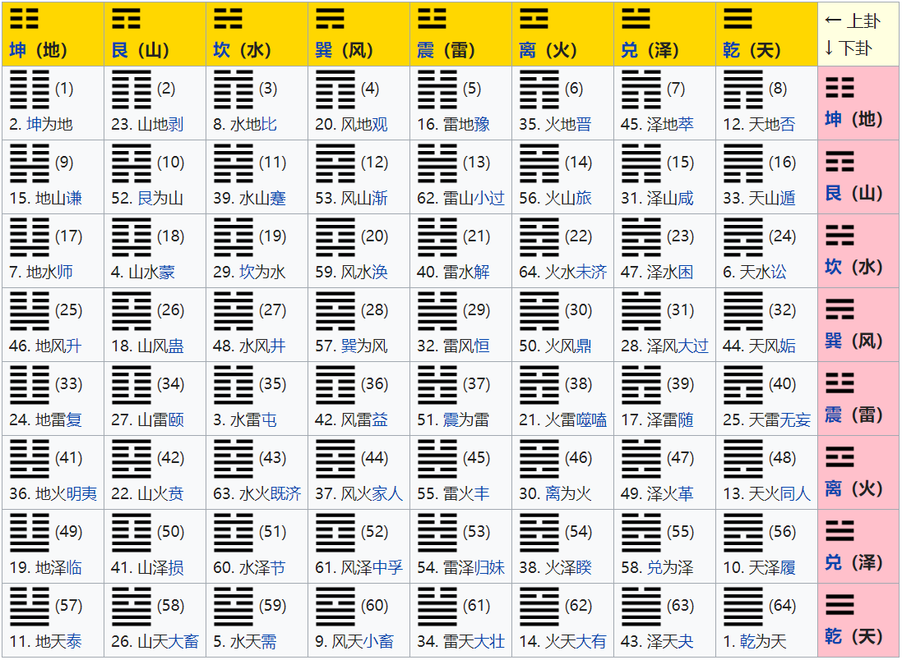

二进制乃是具有世界普遍性的、最完美的逻辑语言  ——莱布尼茨

<!-- more -->

#### 引言 ####

0和1的组合是一种强大的信息编码方式，17世纪的德国数学家[戈特弗里德·莱布尼茨](https://zh.wikipedia.org/wiki/%E6%88%88%E7%89%B9%E5%BC%97%E9%87%8C%E5%BE%B7%C2%B7%E8%8E%B1%E5%B8%83%E5%B0%BC%E8%8C%A8)则是最早认识到这一点的一个人。他从中国的《易经》——探讨阴阳之间的动态平衡的书籍中得到这一灵感。《易经》包含64卦，用来代表不同的状态或过程，正是这些内容激发了莱布尼茨的灵感，从而创造出二进制的数学理论

----

#### 起源 ####

> 通常的算术方法是基于逢十进位的法则。我们使用十个符号，0,1,2,3,4,5,6,7,8,9，来表示零一及随后的数，一直到九的数字。然后当到达十后，再次从一开始循环。十由“10”来表示；十乘十，也就是一百，用“100”表示；十乘一百，也就是一千，用“1000”表示；十乘一千为一万，用“10000”表示；以此类推。
然而多年来，我不使用十进制，而是用最简单的进制方式——逢二进位，并发现它对于优化数学科学有重要作用。我只需要用0和1两个符号，并逢二进位。在这个系统下，二用“10”表示；二乘二，也就是四，用“100”表示；二乘四为八，用“1000”表示；二乘八为十六，用“10000”表示；以此类推。
——摘自《论只使用符号0和1的二进制算术，兼论其用途及它赋予伏羲所使用的古老图形的意义》

莱布尼兹认为易经中的卦象与二进制算术密不可分。莱布尼兹解读了易经中的卦象，并认为这是其作为二进制算术的证据。

六十四卦，记载于《[易经](https://zh.wikipedia.org/wiki/%E6%98%93%E7%BB%8F)》，每一卦的图像均由两个[八卦](https://zh.wikipedia.org/wiki/%E5%85%AB%E5%8D%A6)上下组合而成，每一卦各有六个[爻](https://zh.wikipedia.org/wiki/%E7%88%BB)。见下图：
上卦下卦中每个卦由三个爻组成，<code>- -</code>为阴爻，表示二进制中的0；<code>——</code>为阳爻，表示二进制中的1，则八个单卦由二进制表示为：

| 坤（地） | 艮（山） | 坎（水） | 巽（风） | 震（雷） | 离（火） | 兑（泽） | 乾（天） |
| :--: | :--: | :--: | :--: | :--: | :--: | :--: | :--: |
| 000 | 100 | 010 | 110 | 001 | 101 | 011 | 111 | 

六十四卦由上卦和下卦组成，这里列举八个卦位：

| 坤为地 | 山天大畜 | 水泽节 | 风雷益 | 雷水解 | 火地晋 | 泽风大过 |  乾为天 |
| :--: | :--: | :--: | :--: | :--: | :--: | :--: | :--: |
| 000000 | 010111 | 010011 | 110001 | 001010 | 101000 | 011110 | 111111 | 

由此会发现六位二进制数从000000到111111共有$2^6$即64种组合方法，正好对应八卦图中64个卦位。

德国哲学家及数学家莱布尼茨在法国传教士白晋的介绍之下，得到邵雍的伏羲先天六十四卦〈方圆四分四层图〉，认为与他在1679年所创的二进制记数系统相符合并在1703年发表论文《[论只使用符号0和1的二进制算术，兼论其用途及它赋予伏羲所使用的古老图形的意义](https://zh.wikisource.org/zh-hans/Translation:%E8%AE%BA%E5%8F%AA%E4%BD%BF%E7%94%A8%E7%AC%A6%E5%8F%B70%E5%92%8C1%E7%9A%84%E4%BA%8C%E8%BF%9B%E5%88%B6%E7%AE%97%E6%9C%AF)》，由此二进制诞生！

----

#### 什么是二进制数 ####

为了便于理解，先说下十进制，人类历史中除了巴比伦的60进制和玛雅文明中的20进制，大部分地区都是使用的十进制，相传是跟人有10根手指有关。十进制由**0 - 9**组成，逢十进一。二进制也有相似的特点：二进制数由0、1组成，特点是逢二进一。

----

#### 二进制与十进制 ####

----

#### 二进制与十六进制 ####

----

