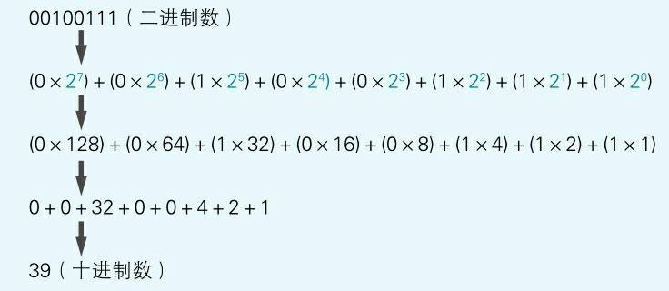
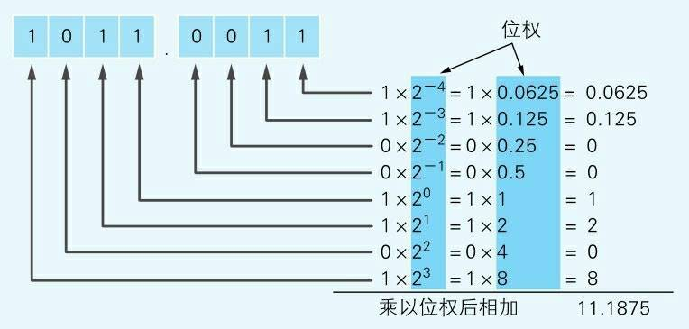
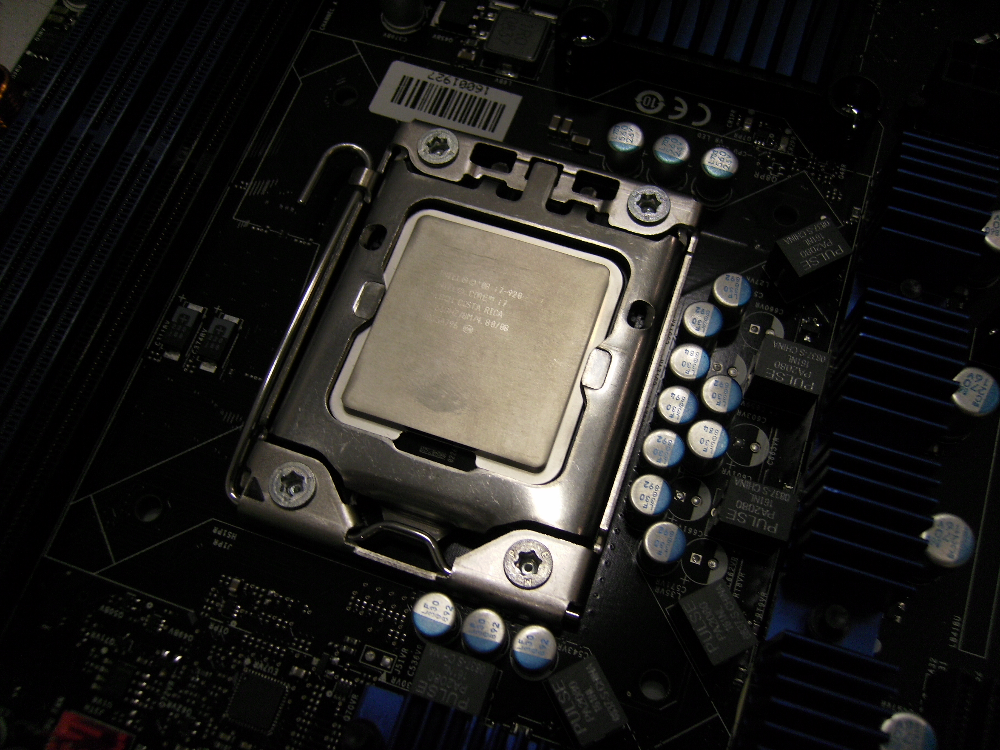

`二进制乃是具有世界普遍性的、最完美的逻辑语言  ——莱布尼茨`

#### 引言 ####

0和1的组合是一种强大的信息编码方式，17世纪的德国数学家[戈特弗里德·莱布尼茨](https://zh.wikipedia.org/wiki/%E6%88%88%E7%89%B9%E5%BC%97%E9%87%8C%E5%BE%B7%C2%B7%E8%8E%B1%E5%B8%83%E5%B0%BC%E8%8C%A8)则是最早认识到这一点的一个人。他从中国的《易经》——探讨阴阳之间的动态平衡的书籍中得到这一灵感。《易经》包含64卦，用来代表不同的状态或过程，正是这些内容激发了莱布尼茨的灵感，从而创造出二进制的数学理论

----

<!-- more -->

#### 二进制的由来 ####

> 通常的算术方法是基于逢十进位的法则。我们使用十个符号，0,1,2,3,4,5,6,7,8,9，来表示零一及随后的数，一直到九的数字。然后当到达十后，再次从一开始循环。十由“10”来表示；十乘十，也就是一百，用“100”表示；十乘一百，也就是一千，用“1000”表示；十乘一千为一万，用“10000”表示；以此类推。
然而多年来，我不使用十进制，而是用最简单的进制方式——逢二进位，并发现它对于优化数学科学有重要作用。我只需要**用0和1两个符号，并逢二进位**。在这个系统下，二用“10”表示；二乘二，也就是四，用“100”表示；二乘四为八，用“1000”表示；二乘八为十六，用“10000”表示；以此类推。
——摘自《论只使用符号0和1的二进制算术，兼论其用途及它赋予伏羲所使用的古老图形的意义》

莱布尼兹认为易经中的卦象与二进制算术密不可分。莱布尼兹解读了易经中的卦象，并认为这是其作为二进制算术的证据。

六十四卦，记载于《[易经](https://zh.wikipedia.org/wiki/%E6%98%93%E7%BB%8F)》，每一卦的图像均由两个[八卦](https://zh.wikipedia.org/wiki/%E5%85%AB%E5%8D%A6)上下组合而成，每一卦各有六个[爻](https://zh.wikipedia.org/wiki/%E7%88%BB)。见下图：
上卦下卦中每个卦由三个爻组成，<code>- -</code>为阴爻，表示二进制中的0；<code>——</code>为阳爻，表示二进制中的1，则八个单卦由二进制表示为：

| 坤（地） | 艮（山） | 坎（水） | 巽（风） | 震（雷） | 离（火） | 兑（泽） | 乾（天） |
| :--: | :--: | :--: | :--: | :--: | :--: | :--: | :--: |
| 000 | 100 | 010 | 110 | 001 | 101 | 011 | 111 | 

六十四卦由上卦和下卦组成，这里列举八个卦位：

| 坤为地 | 山天大畜 | 水泽节 | 风雷益 | 雷水解 | 火地晋 | 泽风大过 |  乾为天 |
| :--: | :--: | :--: | :--: | :--: | :--: | :--: | :--: |
| 000000 | 010111 | 010011 | 110001 | 001010 | 101000 | 011110 | 111111 | 

由此会发现六位二进制数从000000到111111共有$2^6$即64种组合方法，正好对应八卦图中64个卦位。

德国哲学家及数学家莱布尼茨在法国传教士白晋的介绍之下，得到邵雍的伏羲先天六十四卦〈方圆四分四层图〉，认为与他在1679年所创的二进制记数系统相符合并在1703年发表论文《[论只使用符号0和1的二进制算术，兼论其用途及它赋予伏羲所使用的古老图形的意义](https://zh.wikisource.org/zh-hans/Translation:%E8%AE%BA%E5%8F%AA%E4%BD%BF%E7%94%A8%E7%AC%A6%E5%8F%B70%E5%92%8C1%E7%9A%84%E4%BA%8C%E8%BF%9B%E5%88%B6%E7%AE%97%E6%9C%AF)》，由此二进制诞生！

----

#### 二进制与十进制 ####

二进制与十进制是如何相互转换的呢？下面首先说明二进制数如何转换为十进制数。

##### 位权 #####

首先介绍一下位权，[百度百科](https://baike.baidu.com/item/%E4%BD%8D%E6%9D%83)对<code>位权</code>的定义是**位权，是指数制中每一固定位置对应的单位值**，计算方法为**数码本身乘以与它数位有关的常数**。

例如，十进制数39，9表示的是<code>9 * 1</code>，3表示的是<code>3 * 10</code>。这里和各个数位的数值相乘的<code>1</code>和`10`，就是位权。数字的位数不同，位权也就不同，第一位的位权是$10^0 = 1$，第二位的位权是$10^1 = 10$，第三位的位权是$10^2 = 100$，以此类推第n位的位权是$10^{n - 1}$。二进制是同样的，第一位的位权是$2^0 = 1$，第二位的位权是$2^1 = 2$，第三位的位权是$2^2 = 4$，以此类推第n位的位权是$2^{n - 1}$。

---

##### 二进制转换为十进制 #####

二进制数转换成十进制数，`只需将二进制数的各数位的值和位权相乘，然后将相乘的结果相加即可`。这里以`00100111`为例，如下图：


二进制同样可以表示`小数`的，由上文了解到二进制的位权位于数位的关系为$2^{n - 1}$，n表示数位，因此第一位为$2^{1 - 1}$，也就是$2^0$；第二位的位权为$2^{2 - 1}$，也就是$2^1$。那么表示小数也是一样的，小数点后面的位权也是跟位数相关联的，小数点后面的`位权`跟`位数`的关系为$w = 2^{-n}$，其中`w`表示位权，`n`表示小数点后面第`n`位，即小数点后面第一位的位权为$2^{- 1}$，这里`n = 1`；小数点后面第二位的位权为$2^{-2}$，这里`n = 2`，因此将二进制小数转换为十进制时原理是一样的。下面以二进制数`1011.0011`为例说明转换方法，如下图：

需要注意的是：<b><font color="#891717">二进制整数部分的位权与数位的关系是$2^{n - 1}$，此时n表示小数点左边第n位。小数部分的位权与数位的关系是$2^{-n}$，此时n表示小数点右边第n位。</font></b>

---

##### 十进制转换为二进制 #####

十进制数转换成二进制数，有两句口诀：<b><font color="#891717">整数采用"除2取余，逆序排列"法</font>、<font color="#ea36ec">小数采用"乘2取整，顺序排列"法</font></b>。

下面是[百度百科](https://baike.baidu.com/item/%E5%8D%81%E8%BF%9B%E5%88%B6%E8%BD%AC%E4%BA%8C%E8%BF%9B%E5%88%B6)的证明方法：

1. 假设十进制整数`w`转换位二进制数为`abcde`，`abcde Ɛ [0,1]`,即:
$w_{(十进制)} = abcde_{(二进制)}$
$w = e * 2^0 + d * 2^1 + c * 2^2 + b * 2^3 + a * 2^4$ 
$w * 2^{-1} = e/2 + d * 2^0 + c * 2^1 + b * 2^2 + a * 2^3$，因为`e`只能取值`0、1`，所以这里不能被2整除，即此处余数 `e`，同理
$w * 2^{-2} = d/2 + c * 2^0 + b * 2^1 + a * 2^2$，此处余数`d`
$w * 2^{-3} = c/2 + b * 2^0 + a * 2^1$,此处余数`c`
$w * 2^{-4} = b/2 + a * 2^0$，此处余数`b`
$w * 2^{-5} = a/2$，此处余数`a`
<b><font color="#891717">然后将余数按顺序反过来排列，正好是abcde，整数转换方法"除2取余，逆序排列"证明完成。</font></b>

2. 假设十进制小数`s`转换为二进制数为`mnxyz`, `mnxyz Ɛ [0,1]`，即:
$s_{(十进制)} = mnxyz_{(二进制)}$
$s = m * 2^{-1} + n * 2^{-2} + x * 2^{-3} + y * 2^{-4} + z * 2^{-5}$
$s * 2^1 = m + n * 2^{-1} + x * 2^{-2} + y * 2^{-3} + z * 2^{-4}$，因为m只能取值`0、1`，所以这里拿出整数`m`，同理
$s * 2^2 = n + x * 2^{-1} + y * 2^{-2} + z * 2^{-3}$，拿出整数`n`
$s * 2^3 = x + y * 2^{-1} + z * 2^{-2}$，拿出整数`x`
$s * 2^4 = y + z * 2^{-1}$，拿出整数`y`
$s * 2^5 = z$，拿出整数`z`
<b><font color="#ea36ec">然后将整数按顺序排列，正好是mnxyz，小数转换方法"乘2取整，顺序排列"证明完成。</font></b>
----

#### 二进制与八进制 ####

将二进制数转八进制数的方法为**取三合一法**，即从二进制的小数点为分界点，向左（向右）每三位取成一位，接着将这三位二进制按权相加，然后，按顺序进行排列，小数点的位置不变，得到的数字就是我们所求的八进制数。如果向左（向右）取三位后，取到最高（最低）位时候，如果无法凑足三位，可以在小数点最左边（最右边），即整数的最高位（最低位）添0，凑足三位。

下面以`11010111.0100111`为例进行说明,将二进制数`11010111.0100111`按照取三合一法进行分割后得
```text
11010111.010011

`011 010 111.010 011 100`
```
根据八卦图所得应该为`兑坎乾.坎兑艮`，当然这是开玩笑的，将每组二进制转换为十进制为`327.234`，即<font color="#891717">$11010111.0100111_b = 327.234_o$</font>

---
#### 二进制与十六进制 ####

将二进制数转十六进制数的方法跟将二进制转换为八进制的方法类似，只不过将`三`位改为`四`位，即**取四合一法**，即从二进制的小数点为分界点，向左（向右）每四位取成一位，接着将这四位二进制按权相加，然后，按顺序进行排列，小数点的位置不变，得到的数字就是我们所求的八进制数。如果向左（向右）取四位后，取到最高（最低）位时候，如果无法凑足四位，可以在小数点最左边（最右边），即整数的最高位（最低位）添0，凑足四位。

下面仍以`11010111.0100111`为例进行说明,将二进制数`11010111.0100111`按照取四合一法进行分割后得
```
11010111.0100111

1101 0111.0100 1110
```
将每组二进制转换为十进制为`13 7 . 4 14`，当然这是不对的，十六进制由`0 1 2 3 4 5 6 7 8 9 A B C D E F`组成，`13 14对应十六进制中D E`，即<font color="#891717">$11010111.0100111_b = D7.4E_h$</font>

----

#### 二进制与计算机 ####

##### 计算机为什么使用二进制 #####

计算机进行指令解析和处理数据的设备是CPU，即`中央处理器`，CPU是一种大规模集成电路，如图：

CPU中的逻辑门或晶体管只有`通电`和`断电`两个状态，即一个晶体管只能表示两个状态。这个特性决定了计算机的信息数据只能用二进制数来处理。虽然二进制不是专门为CPU设计的，但是和CPU的特性非常吻合。

计算机处理信息的最小单位——`位`，英文名bit是二进制数位`(binary digit)`的缩写。二进制数的位数一般是8bit、16bit、32bit、64bit……也就是8的倍数，这是因为计算机所处理的信息的基本单位是8位二进制数。8bit二进制数被称为一个`字节(byte)`，`字节是最基本的信息计量单位`。`位是最小单位`，`字节是基本单位`。内存和磁盘都使用字节单位来存储和读写数据，使用位单位则无法读写数据，因此字节是信息的基本单位。

core i7处理器是64位的，有64个引脚用于信息的输入和输出，因此酷睿i7处理器一次可以处理64位(64位 = 8字节)的二进制信息，倘若数据只有8位则高位56位补`0`，程序中使用十进制数和文字等记述信息在编译后也会转换成二进制数的值，所以程序运行时计算机内部处理的也是用二进制表示的信息。

--- 

##### 计算机如何使用二进制 #####

计算机在处理运算时时如何通过二进制进行表示的呢？

下面介绍二进制的三种表示方法：`原码`、`反码`、`补码`。
>原码：是一种计算机中对数字的二进制定点表示方法。原码表示法在数值前面增加了一位符号位（即最高位为符号位）：正数该位为0，负数该位为1（0有两种表示：+0和-0），其余位表示数值的大小。
反码：正数的反码与其原码相同；负数的反码是原码符号位不变，其他位按位取反。
补码：正数的补码与其原码相同；负数的补码是在其反码的末位加1。

**为什么要使用原码、反码和补码呢？**

1. 原码很容易理解，比如8位二进制数来表示1和-1：
```text
 1 = 0000 0001
-1 = 1000 0001
```
原码最为符合我们的思考习惯，但是计算机只会做加法运算，不会减法运算，换言之，计算机会将减法转换成加法进行运算。比如`1 - 1`，计算机会通过`1 + (-1)`来进行计算。那么使用原码进行计算1 - 1可行吗？
$1 - 1 = 1 + (-1) = 00000001 + 10000001$，看出问题了吧，结果为`10000010`，总之结果不为0是不对的，看来符合我们的思考习惯的运算方法不适合计算机。

2. 
