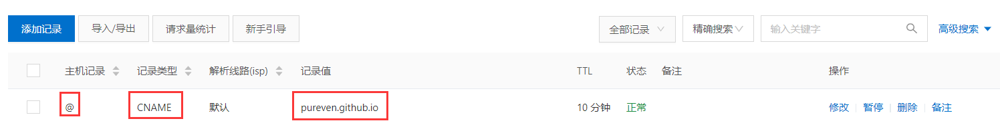
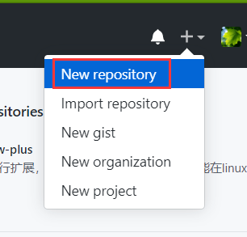
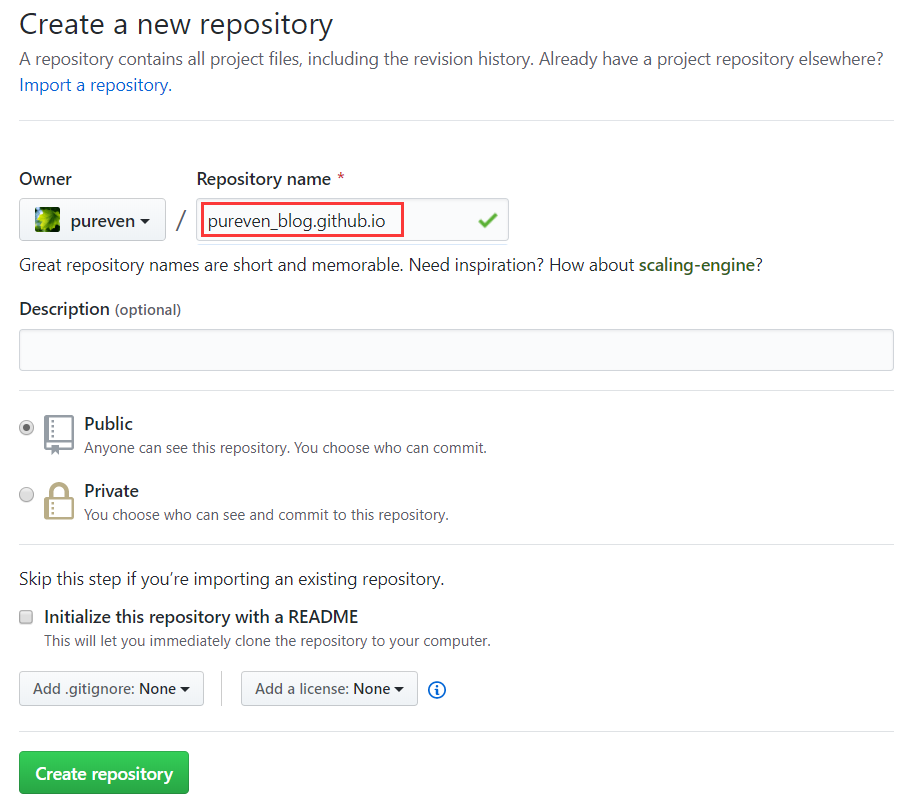
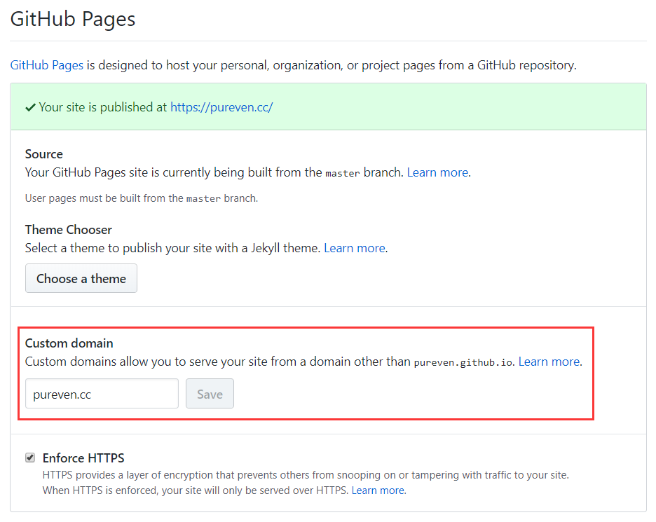
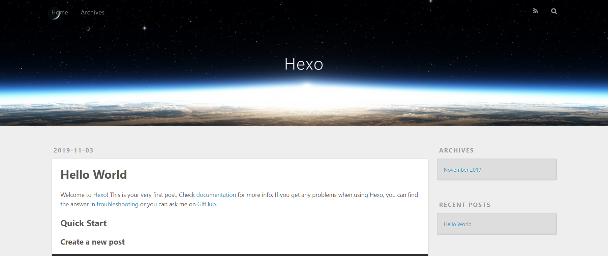
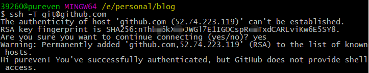

# 创建GitHub Pages

## 注册GitHub
如果没有GitHub账号，需要注册[GitHub官网](https://github.com/)

## 新建仓库
要将项目放在 GitHub 上，您需要创建一个仓库来存放它。[官网给出新建仓库的方法](https://help.github.com/cn/github/getting-started-with-github/create-a-repo)

## 绑定域名

1.现在有很多平台可以注册域名，我是在阿里云注册的域名pureven.cc，这里以阿里云为例，添加解析记录：



2.申请ssl证书

## 创建GitHub Pages
使用Jekyll创建GitHub Pages网站
您可以使用Jekyll在新的或现有存储库中创建GitHub Pages站点。[官网给出的方法是使用Jekyll创建GitHub Pages网站](https://help.github.com/cn/github/working-with-github-pages/creating-a-github-pages-site-with-jekyll)

或根据如下流程创建：
1.点击New respository



Repository name 必须是 you_name.github.io



点击 "Create respository",完成创建。 然后点击Settings，向下拉到最后有个GitHub Pages，Custom domain填写已注册的域名，会变成下面这样：



到这里GitHub Pages设置完成，如何注册并解析域名，请[参考这里](https://www.zhihu.com/question/31377141)

## 安装Hexo

下载并安装Node.js [官网下载地址](http://nodejs.cn/download/) 

安装Hexo可参考[官网](https://hexo.io/zh-cn/docs/index.html#%E5%AE%89%E8%A3%85)
或根据如下步骤：

1.新建用于Hexo项目的目录，比如pureven，然后执行命令<code>npm i hexo-cli</code>进行安装

2.安装完成后，先通过<code>hexo init</code>初始化hexo,然后通过<code>hexo g</code>生成静态网页，通过<code>hexo s --debug</code>开启服务，
然后浏览器输入localhost:4000即可查看默认样式的博客啦。



其他命令可参加[官网命令说明](https://hexo.io/zh-cn/docs/commands)

# 本地搭建博客

##连接GitHub
1.右键选择git bash here, git窗口中输入：
```
git config --global user.name "your name"
git config --global user.email "your email"
```
然后通过<code>ssh-keygen -t rsa -C "your email"</code>生成密钥SSH key，
执行命令<code>cat ~/.ssh/id_rsa.pub</code>，将输出的内容保存到临时文件。

2.打开GitHub，点击头像下的settings，然后点击SSH and GPG keys，新建一个SSH，名字随意
将临时文件中的内容复制到框中，点击保存。

3.在Bash窗口里输入<code>ssh -T git@github.com</code>，如出现下图类似内容则说明成功！



4.进入hexo项目目录，这里是pureven，找到_config.yml文件，设置如下信息：
```
deploy:
  type: 'git'
  repository: https://github.com/pureven/pureven_blog.github.io
  branch: master
```

到这里完成本地到GitHub的连接
